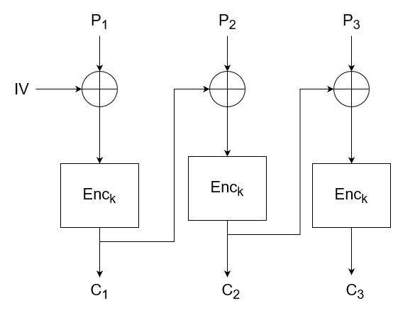

# Introduction
A block cipher is an encryption scheme which works on plaintexts of a fixed size. Furthermore, it is usually paired with a *mode of operation*. The size is typically small, such as 64 or 128 bits, although, it is possible to have smaller or larger block sizes. Large block sizes have a lofty memory footprint and are less efficient. It is, however, paramount that the block size is also not too small lest the cipher becomes vulnerable to a codebook attack. This attack is actuated by the construction of a look-up table which contains all possible plaintext-ciphertext pairs generated by a given block cipher and can be easily used to look up a plaintext given its ciphertext. For example, a block size of 16 requires only $2^{16} \times 2^{16} = 2^{20}$ bits of memory, which is equal to 128 kilobytes. With the 32-bit blocks, the memory needs grow to 16 gigabytes which is still feasible. However, with a block size of 64 bits, the memory required shoots up to $2^{70}$ bits. Good luck storing that.

# Anatomy of a Block Cipher
Block ciphers represent a repetition of *rounds*, which are short and simple sequences of operation. The strength of a block cipher lies not in its complexity, but rather its repetitiveness. The ciphertext of a given block is the sequence of rounds applied to the plaintext: $c = R_3(R_2(R_1(p, {k^{\prime}}), {k^{\prime\prime}}),{k^{\prime\prime\prime}})$. In addition to the output of the previous round, each round also takes in a *round key*. The round keys $k^{\prime},k^{\prime\prime},k^{\prime\prime\prime},...$ are generated from the master key $k$ through an algorithm bearing the name *key schedule*. The round functions $R_1, R_2,...$ are usually the same algorithm which why it is crucial that they are provided with different round keys in order to generate different outputs.

## Slide Attacks and Round Keys
Repeating round keys open room for *slide attacks*. These look for plaintext-ciphertext pairs $(p_1, c_1)$ and $(p_2, c_2)$ where $p_2 = R(p_1)$. Since both the round algorithm and key are identical, then if $p_2 = R(p_1)$ implies that $c_2 = R(c_1)$. This relationship will hold true no matter how many repetitions of the round the plaintext goes through.

# Modes of Operation
It's all well and good with block ciphers when encrypting messages whose length matches the block size, but what happens if we want to encrypt a plaintext that is longer than a single block? Well, here comes the use of a *mode of operation*. If the message is longer than the block size, then it must be split into blocks of the desired size. From then on, the mode of operation describes how each of the blocks is encrypted and how the resulting ciphertexts are combined into the final output.

## The Electronic Codebook (ECB) Mode
This is the simplest mode of operation you could think of. It encrypts each plaintext block independently and then just concatenates the resulting ciphertexts. 

This mode is abominably insecure, since it is *pattern preserving*. While patterns inside each block are destroyed (a proper encryption algorithm should take care of that), patterns between blocks are ultimately preserved. To illustrate, let's say that you want to encrypt the number 19281267. If you have 4-bit blocks, you would encrypt the blocks 1928 and 1267. Suppose, that these get encrypted to 4765 and 4104. If you check, subtracting the second plaintext block from the first yields the same result as subtracting the second ciphertext from the first, namely 661. An infamous example of this is the ECB penguin. Encrypting an image with ECB will yield the same image with merely a distorted colour scheme.

## The Cipher Block Chaining (CBC) Mode
Cipher block chaining resembles ECB, but it actually incorporates the previous block into the encryption of the current one. Instead of encrypting the $i$th block $p_i$ as $c_i = Enc_k(p_i)$, cipher block chaining XORs the plaintext with the previous ciphertext: $c_i = Enc_k(p_i \bigoplus c_{i-1})$. The first plaintext is XOR-ed with a random value called an *initialisation vector (IV)*.

Since each consecutive block depends on the previous one, patterns between blocks are destroyed. Furthermore, if the IV is different each time, two identical plaintexts will produce disparate ciphertexts when encrypted. Note, that for decryption, the IV needs to be known. It is also interesting to mention that CBC decryption can be much faster than encryption due to parallelism. When encrypting, each new block needs to wait for the previous one to be encrypted in order to get its ciphertext, however, with decryption all ciphertexts are already known, so it can optimised on multiple threads.

## Encrypting Non-Conforming Messages
A non-conforming message is a message whose length is not evenly divisible by the block size. For example, you might have a message of size 18 bytes and a block size of 16 bytes. In this case, there are two main ways to resolve the issue.

### Message Padding
Padding allows for the encryption of messages of arbitrary lengths, even ones which are shorter than a single block. It is used to expand a message in order to fill a complete block by appending bytes to the plaintext and it is a highly standardised procedure. 

The most common padding algorithm is described by PKCS#7 in RFC 5652.

Given a block size, $n$, and a message of length $m$, the message is padded with $n-m$ number of bytes of value $n-m$.  A concrete example with 16-byte blocks is the following:
- If there's is one byte left until the message length is divisible by 16 - for example, it is 17 or 33 bytes long - then pad the message with 15 bytes `0x0f` (15 in decimal).
- If there are two bytes left until the message length is divisible by 16 - for example, it is 18 or 34 bytes long - then pad the message with 14 bytes `0x0e` (14 in decimal).
- If there are three bytes left until the message length is divisible by 16, then pad the message with 13 bytes `0x0d` (13 in decimal), and so on.

If the message length is already divisible by the block size, then an additional *block* containing bytes with value equal to the block size is appended in order to signify to the decryption algorithm whether the last block is part of the plaintext or just padding. In the above example, if the message length was already divisible by 16, then another 16 bytes of value `0x10` would have been appended to it.

Decryption is fairly simple and works by first deciphering all the unpadded blocks. Subsequently, the last block is decrypted and the last bytes of the resulting plaintext are checked for conformity with the aforementioned scheme. If such is not found, the message is rejected. Otherwise, the padding bytes are stripped before returning the plaintext.