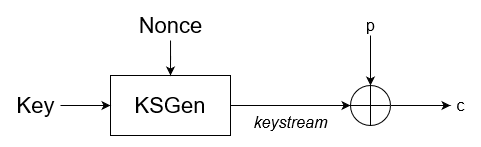
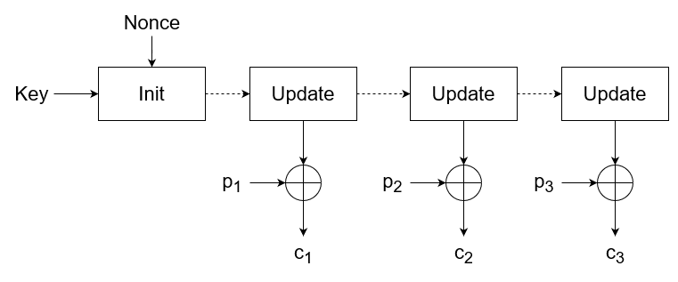

# Introduction
Unlike block ciphers, stream ciphers do not fuse plaintext with key bits. Instead, a stream cipher generates a pseudorandom bits from the key and encrypts the plaintext by XOR-ing it with those bits. The pseudorandom bits are said to construct a *keystream*. In addition to the key, which is usually 128 or 256 bits, a stream cipher also takes a nonce. The nonce need not be secret but should be unique for every key. Nonce sizes are typically between 64 and 128 bits.

It is paramount that the same key-nonce pair $k_1$, $n_1$ is not used for the encryption of multiple messages, since you would then have $c_1 = p_1 \bigoplus ks$ and $c_2 = p_2 \bigoplus ks$, so if you know $p_1$, you could easily determine $p_2 = c_1 \bigoplus c_2 \bigoplus p_1$.

# Stateful and Counter-Based Stream Ciphers
Stream ciphers can be split into two major categories. *Stateful stream ciphers* have an internal state which is morphed during the encryption process. The state is first initialised from the key and the nonce. Subsequently, an update function function is invoked which changes the state and produces one or more keystream bits from it. 

The other type is *counter-based stream ciphers*. These produce chunks of keystream bits by taking the key, nonce and a counter which changes at every turn.

