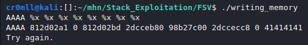

# Introduction
The C language provides certain functionality for converting variables into human-readable strings. This can be seen in functions like `printf`. For example, the following code will combine the string `"Printing the magic number... The magic number is "` with the number stored in `a`.

```cpp
int a = 2;
printf("Printing the magic number... The magic number is %d\n.", &a);
```

The first argument is called the format string and `%d` is known as a format parameter. When using a variable as a format argument, you need to pass its address. There also exist multiple format parameters:

| Parameter | Meaning | Passed as |
|:----------:|:---------|:----------:|
| %p | Prints the argument as a pointer | Value |
|%%| Prints a % character| Value |
| %d| Prints a signed decimal number | Value |
| %u| Prints an unsigned decimal number| Value |
| %x| Prints the argument as a hexadecimal number| Value |
|%s| Prints a string| Pointer |
|%n| Prints nothing, but stores the number of bytes written so far in the location specified by the pointer passed as an argument | Pointer |

When `printf` is invoked, it goes backwards from the beginning of its stack frame through the stack in order to retrieve its arguments one by one. If a format string is specified but no actual arguments are pushed to the stack before the function is invoked, for every format parameter `printf` will go backwards through the stack. This will lead to the erroneous interpretation of stack memory and can lead to memory leaks. Furthermore, the `%n` format parameter can be utilised for writing arbitrary memory by manipulating the pointer into which it should store the number of bytes written so far. Consequently, format string vulnerabilities can beget arbitrary code execution by overwriting the GOT.

# The Essence of a Format String Vulnerability
Format string vulnerabilities occur when the format string of a function such as `printf` is passed directly as a buffer which can be manipulated by an attacker. The buffer itself may contain format characters which can be abused in arbitrary ways.

```cpp
char input[100];
scanf("%100s", input);

printf(input);
```

This code is abominable, since the `input` buffer is entirely controlled by the user. If any format parameters are included in the buffer, `printf` will treat them accordingly and this can result in all sorts of mishaps. The correct way to implement such code is to actually pass the user input as a format argument to a format string in `printf`:

```cpp
char input[100];
scanf("%100s", input);

printf("%100s", input);
```

## Leaking Memory
Format string vulnerabilities can be easily exploited to leak memory on the stack. This is typically done through the use of the `%p` or `%x` format parameters. Filling a format string with those parameters will continuously leak stack memory. Sometimes, however, the buffer we are writing to doesn't have enough space to store enough parameters for us to reach the value we want to leak. Luckily, C has some syntax sugar which allows us to retrieve a particular argument. This is done by using `%n$parameter`, where `n` is the number of the argument we want to access and `parameter` is the format parameter we want to use. Consequently, if we want to print the third value on the stack as a pointer, we would use `%n$p`.

Here is a simple example of such an attack.

leaking_memory.c:

```cpp
#include <stdio.h>
#include <string.h>
#include <stdlib.h>

int main(void)
{

int input = 0;
int key = 0xdeadbeef;
char message[100];

printf("Enter a message to be sent:\n");

fgets(message, sizeof(message), stdin);

printf("The following message will be sent: \n");
printf(message);

printf("Enter the secret key in order to send the message. \n");
scanf("%d", &input);

if (input == key)
{
	printf("Message successfully sent!\n");
}
else
{
	printf("Failed to send message!\n");
}


return 0;
}
```


## Writing Arbitrary memory
The `%n` format parameter can be used to write to arbitrary memory. Recall that it takes a pointer a pointer as its argument, but where does it get this pointer from? Well, just as any other argument, this pointer is retrieved from the stack. But wait a minute... In i386 and amd64 function arguments are pushed to the stack before a procedure is invoked. Consequently, we can write any value to the stack by including it in the format string, navigating to this value with `%x` or `%p` and then just put a `%n` to treat this value as a location and write to it. As a shortcut, we can use the `%parameter$n`  to choose a particular value on the stack to treat as a pointer. 

However, writing a large value would require a lot of characters before `%n`. Luckily, we can print those with a shortcut. Before `%n` we need to insert `%<value>x` and this will write `value` characters to the screen.

writing_memory.c:
```cpp
#include <stdlib.h>
#include <unistd.h>
#include <stdio.h>
#include <string.h>

int target = 0xdeadbeef;

int main(int argc, char *argv[])
{
	char buffer[64];

    fgets(buffer, 64, stdin);
    printf(buffer);

    if(target == 0xdeadc0de) 
    {
      	printf("Pwned!\n");
    	return EXIT_SUCCESS;
	} 
	else 
	{
  	  	printf("Try again.\n");
  	  	exit(EXIT_FAILURE);
  	}
}
```

Upon looking at this code, we immediately notice the potential for a format string vulnerability. We need to somehow overwrite the `target` variable and change its value to `0xdeadc0de`. This can be done through `%n`, but requires the address of `target`. You might need to use some type of leak to do this, but as an example I will use gdb, which on my machine tells me that `target` is located at `0x555555558048`. 

Since this address will be included in the format string, the location of the beginning of the format string on the stack must be found. This can be done through some light fuzzing by putting, for example, a string of `A`s in the beginning and then following it up with `%x`s until the repeating `A`s are reached. The final cound to `%x` that have been used is the number of the argument. 



Consequently, the beginning would be the 8th argument. Consequently, it is possible to calculate the argument number for the address included in the string.

We now have the address we want to write to, all that is needed is to set up the value we want to write. This means that we have to find a way to print a number of `0xdeadc0de` bytes before `%n`. One would be crazy for thinking that *actually* inserting so many bytes into the buffer is even possible. The trick here is to use specify the number of characters we want to pad `%n` with by using `%x` like so - `%<padding>x%<argument>$n`. Even still, the value is too large to be printed in a reasonable time. Here we are allowed to buck the system by splitting the value at the middle like so `dead` and `c0de` and just writing two short integers rather than one huge integer. Ergo, `0xdead` should be written at `0x555555558048 + 2 = 0x55555555804a`, whereas `0xc0de` should be placed at `0x555555558048`.

The amount of padding is given by the following formula:
`<The value needed> - <Bytes already written>`

It is now possible to proceed. Let's commence with the least significant bytes - `0xc0de` (49374 in decimal). It is best if the address where we want to write to is put at the *end* of the string, since the internal stack pointer of `printf` only works with 8-byte displacements and, consequently, any address must have its leading `0`s until it takes up the entire 8 bytes. Additionally, a certain number of non-zero bytes may need to be inserted before the address in the format string for further alignment purposes.

To simplify matters here, both `0xdeadc0de` and `0xdeadbeef` begin with the same bytes, so we need only overwrite the last ones. If that were not the case, one would simply have to chain multiple paddings with multiple `%n` format parameters. Therefore, our format string should be the following:

`"%49374x%<argument>$n<padding bytes><zero-extended address>"`

The `argument` number may from system to system and you have to either bruteforce it or calculate it using a debugger like gdb. I have calculated it be 10. You may need further padding bytes and the number of bytes has to either again be bruteforced or calculated. Any addresses to write to should be placed at the end of the string to avoid premature null-termination. Our final string looks like this:

`"%49374x%10$hnAAA\x48\x80\x55\x55\x55\x55\x00\x00"`

The `h` before the `n` just tells `printf` to write a `short` instead of an `int` (Remember that we are only overwriting the last two bytes).

*Note: You might be tempted to just print this string with python and pipe it into the program, but that's an appalling approach since the address may contain weird bytes that are outside the range of ASCII and this will result in errors. This can be bypassed by writing the exact bytes to a blank binary file and just piping the file instead of the python output. You might have to do this manually through a hex editor*.

I have now created a file called `input` which contains the following bytes:


Piping this file into the programme results in the overwriting of the `target` variable!


