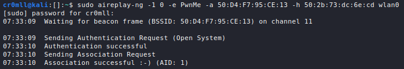

# Introduction
The *wired equivalent privacy (WEP)* standard was introduced in 1997 and its goal was to provide the same level of privacy to wireless networks that wired ones had. Unfortunately, a series of severe flaws quickly made it obsolete and it was superseded by WPA and WPA2. While rare, it is still possible to find networks today which use WEP. 

Under the hood, WEP uses a [stream cipher](../../Cryptography/Stream%20Ciphers/README.md) called RC4 with a key and an IV which should be generated anew with every encryption. The key is static and is set in the AP's configuration. The IV is typically 24 bits in size and is used in combination with the key to encrypt the packets. The IV should be unique for every encrypted, but due to its small size - 24 bits - there are only so many possible IVs. Eventually, IVs will have to be repeated and this is where all hell breaks loose. On average, IVs are typically repeated every 6 000 frames.


Once an attacker gets their hands on two ciphertexts (encrypted packets), $c_1$ and $c_2$, which were encrypted with the same IV (the key is already the same for both of them), then they know $c_1 \oplus c_2$. Now, the adversary can begin brute-forcing the corresponding plaintexts, $p_1$ and $p_2$. Typically, there would be a large number of possible $p_1$s and $p_2$s, but it is known that they must look like packets which greatly reduces the possibilities. This is narrowed down even further when performing a fake authentication attack since the packets captured with identical IVs are likely ARP responses from the AP which have an even easier form to predict! 
 Since $c_1 \oplus c_2 = p_1 \oplus p_2$, with the correct $p_1$ and $p_2$ brute-forced, the keystream used to encrypt them can be calculated: $c_1 \oplus p_1 = k$. Through the use of a few more techniques such as Fluhrer, Mantin, and Shamir (FMS) attacks or PWT, the original key can be retrieved.

# Capturing the Traffic
The only thing that's really required for this attack is enough captured packets with as many IVs as possible. The higher the number of frames, the better the odds that a pair of them was encrypted with the same IV.

`airodump-ng` can be used to listen for WEP networks with the following syntax.
```
sudo airodump-ng --encrypt WEP <dev>
```


Once the network to be attacked has been identified, it can be specifically monitored with `airodump-ng`. You should now also specify a capture file:
```
sudo airodump-ng --encrypt WEP --bssid <BSSID> -c <channel> -w <filename> <dev>
```


Now, you will need to be patient in order to gather a large amount of frames, typically in the range of 50K - 200K depending on whether the key is 64 or 128 bits in length. On a calm network, however, this process may take a very long time. Luckily, it can be sped up using a *fake authentication attack* and *ARP packet replay*.

# Fake Authentication Attack
The ultimate goal of this attack is to enable an adversary to force the AP to send out more and more packets, typically through ARP replay, so that more IVs can be captured. However, in order to elicit any proper response with an IV from the access point, the attacker must be authenticated and and their MAC address needs to be associated with it. Otherwise, the AP simply replies with a deauth frame in cleartext to any packets sent by the adversary, which generates no IVs.

WEP supports two types of authentication - Open System Authentication (OSA) and Shared Key Authentication. 

The former is fairly simple. A needs only send a request to the AP telling it that it wants to authenticate to the network using OSA. If this is allowed, then the client will be associated with the network without any password, however, they will still need the key in order to encrypt and decrypt traffic going through the network. On the other hand, now that they are associated with the network, they can elicit responses with IVs from the AP.

When OSA is enabled, you can use the following command to authenticate with the AP:
```
sudo aireplay-ng -1 <rate> -e <ESSID> -a <access point MAC> -h <MAC of your wireless adapter> <dev>
```

- `-1` denotes fake authentication.
- `<rate>` - is the rate at which to attempt reassociation. 0 means a continuous stream of attempts until success.
- `-e` - the ESSID of the target network.
- `-a` - the BSSID of the target network.
- `-h` - the MAC address of your wireless adapter.

Note, `airodump-ng` should be locked to the target network and its channel, so as to prevent channel hopping.




Now that you are associated with the network, you can proceed to ARP relaying.

If OSA is not allowed by the target network, then the process is a bit more complicated. In shared key authentication, a client needs to already have the key in order to authenticate, although there is a way around that. When connecting to the network, the AP sends a *challenge* (random bytes), in clear text, to the client. The client must encrypt the sent challenge with the WEP key and send it back to the AP. When the AP receives the encrypted challenge, it attempts to decrypt it using the WEP key and if the decrypted challenge matches what was originally sent in cleartext, then the client is authenticated.

If you are able to sniff on the network, you can just capture this shared key handshake when another client authenticates to the AP (either naturally or by dint of a [deauth attack](Deauth%20Attack.md). Since you captured the plaintext challenge, $p_1$ from the AP and the correctly encrypted response challenge from the legitimate client, $c_1$, you can obtain the keystream $k = p_1 \oplus c_1$ and use it to correctly encrypt the challenge you receive when attempting to connect to the AP yourself.

Faking shared key authentication requires a PRGA file containing the SKA (shared key authentication) handshake. To acquire it, all you need to do is sniff on the network and either wait for a client to connect to it or deauthenticate an existing one to force them to reconnect. When the handshake has been captured, `SKA` will appear beneath the `AUTH` column in `airodump-ng`.
```
sudo airodump-ng --encrypt WEP --bssid <BSSID> -c <channel> -w <filename> <dev>
```


The `.xor` file is the required PRGA file which can now be used with `aireplay-ng` to do fake authentication:
```
sudo aireplay-ng -1 <rate> -e <ESSID> -a <access point MAC> -h <MAC of your wireless adapter> -y <PRGA file> <dev>
```


You can now proceed with ARP replaying in order to generate IVs.

## ARP Replay Attack
An ARP replay attack is one of the easiest ways to generate new IVs. `aireplay-ng` will listen for ARP packets on the network and once it gets its hands on at least one packet, it is going to save it into a capture file and continuously resend it to the AP. While the ARP packet itself is not going to change, the responses it will beget from the access point will all generate new IVs. At this point, `airodump-ng` should also be running in order to capture the responses and their IVs. 

Since some ARP packets are typically sent when a device connects to a network, you can using a [deauth attack](Deauth%20Attack.md) to speed up the process of gathering samples.

The basic syntax for an ARP replay is the following:
```
sudo aireplay-ng -3 -b <BSSID of the target network> -h <MAC address of your wireless adapter> <dev>
```

A capture file with ARP packets from a previous ARP relay attack may be optionally specified with `-r`.


Once run, the Frames and Data count in `airodump-ng` should begin rapidly increasing, while the response packets with the IVs are captured.


# Cracking the Key
Once you have a sufficient number of IVs, you can use the `.cap` file generated by `airodump` to crack the key:
```
sudo aircrack-ng <filename>
```


If the key isn't found, then that means that no identical IVs were captured and the process needs to be repeated.