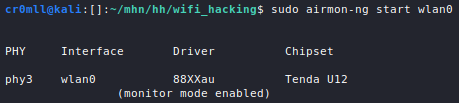
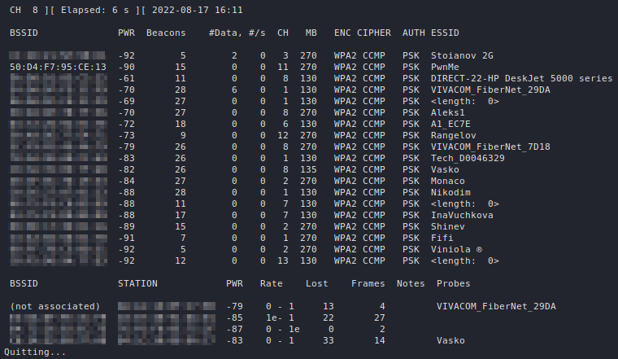
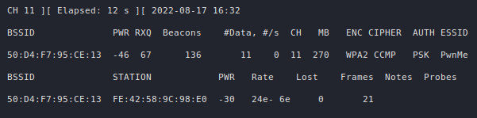

# Introduction
WiFi has become an integral part of our lives.

Many wireless attack will require a wireless adapter which supports [monitor mode and packet injection](https://deviwiki.com/wiki/List_of_Wireless_Adapters_That_Support_Monitor_Mode_and_Packet_Injection).

<h1 id="monitor-mode"> Monitor Mode </h1>
Monitor mode disconnects a wireless interface from any network that it may be connected to and allows the device to listen to *all* traffic in the area at the same, from *all* access points and *all* clients. 

Since certain processes may interfere with the wireless device, they should be checked for before putting the wireless card into monitor mode. This can be done via the following command:
```
sudo airmon-ng check
```


`airmon-ng` is also capable of stopping these processes if `kill` is added to the above command:
```
sudo airmon-ng check kill
```


A list of the available network devices may be obtained through `iwconfig`:


In order to put a wireless card into monitor mode, the following command may be used:
```
sudo airmon-ng start <dev>
```



Alternatively, the following sequence of commands may be used:
```
sudo ifconfig <dev> down
sudo iwconfig <dev> mode monitor
sudo ifconfig <dev> up
```

When putting a wireless device into monitor mode, its name may be altered, for example by appending `mon`. It is useful to again list the network devices connected to the system to check if any names have been changed.


Once you are done, you should disable monitor mode:
```
sudo airmon-ng stop wlan0
```


Alternatively, `ifconfig` and `iwconfig` may be also be used to disable monitor mode:

```
sudo ifconfig <dev> down
sudo iwconfig <dev> mode managed
sudo ifconfig <dev> up
```

Finally, you should restart the process killed by `airmon-ng`:
```
sudo systemctl start NetworkManager 
```

<h1 id="capturing-traffic">Capturing WiFi Traffic </h1>
WiFi hacking relies heavily on the traffic captured from the air. A very useful tool which can accomplish this task is `airodump-ng`. Its basic syntax looks like this:

```
sudo airodump-ng <dev>
```

By default, it monitors all networks in the area by hopping around channels.



If 5GHz WiFi is supported by your adapter, you can add `--band a` to the command to listen for 5GHz networks:
```
sudo airodump-ng --band a <dev>
```


Let's decipher the output. The first table, which `airodump-ng` displays, describes all the networks that are seen by the wireless adapter. 

| Column | Description |
|:--------:|--------------|
|`BSSID`| The MAC address of the access point. |
|`PWR`| The signal level reported by the wireless adapter. Strong signals are around `-40`, average ones ~ `-55`, and a weak signal begins at `-70`. If it is equal to `-1` everywhere, then signal level reporting is not supported by the driver. If it is `-1` for some APs, then that access point is out of range but at least one frame was able to be sent to it. |
|`Beacons`| The number of beacon frames sent by the AP. Through these packets the AP announces its presence to the devices in the area. They are typically sent about 10 times per second at the lowest rate (1M) and can be picked up from afar. |
|`#Data` | The number of captured data packets (if WEP, unique IV count), including data broadcast packets. |
|`#/s` | The number of data packets per second for the last 10 seconds. 
|`CH`| The channel number (as reported by the beacon frames). It is sometimes possible to capture packets from different channels due to interference or channel overlap, even when `airodump-ng` is not hopping. |
|`MB`| The maximum speed supported by the AP. If `MB = 11`, it's 802.11b, if `MB = 22` it's 802.11b+ and up to 54 are 802.11g. Higher values are either 802.11n or 802.11ac. A dot after this value indicates support for a short preamble, an `e` indicates that the network has QoS enabled.|
|`ENC`| The encryption algorithm in use. `OPN` means no encryption, `WEP` indicates static or dynamic WEP, `"WEP?"` = WEP or higher (not enough data to choose between WEP and WPA/WPA2), and `WPA`, `WPA2` or `WPA3` if TKIP or CCMP is present (WPA3 with TKIP allows WPA or WPA2 association, pure WPA3 only allows CCMP). `OWE` is for Opportunistic Wireless Encryption, or Enhanced Open.|
|`CIPHER`| The detected cipher - `CCMP`, `WRAP`, `TKIP`, `WEP`, `WEP40`, or `WEP104`. Typically, TKIP is used with WPA and CCMP with WPA2. WEP40 is displayed when the key index is greater than 0. The index can be 0-3 for 40bit and should be 0 for 104 bit.|
|`AUTH`| The authentication protocol in use - `MGT` (WPA/WPA2 using a separate authentication server), `SKA` (shared key for WEP), `PSK` (pre-shared key for WPA/WPA2), or `OPN` (open for WEP).|
|`ESSID`| The display name (SSID) of the network. If it has the form of `<length: x>`, then the SSID is hidden and the `x` represents its length (`airodump-ng` is capable of some analysis of hidden SSIDs). If `x` is 0 or 1, then the real length is indeterminable. |

The second table describes all the *clients* which are seen by the wireless adapter. A client here means any device that is WiFi-enabled, but is *not* an access point - this can be a phone, a PC, a laptop, etc. 

| Column | Description |
|:--------:|--------------|
|`STATION`| The MAC address of the client. |
|`BSSID`| The MAC address of the AP that the client is connected to. If the client is not associated with any network, then this will be `(not associated)`. |
|`PWR`| The signal level reported by the wireless adapter (see the above table). If this is `-1` everywhere, then signal level reporting is likely unsupported. If this is `-1`, then the device is out for reach for your wireless adapter, but a frame sent to it by the AP was detected. |
|`Rate`|  The client's last seen reception rate followed by its last seen transmission rate (both in Mbps). An `e` is appended to each rate if QoS is enabled on the network. |
|`Lost`| The number of data packets lost from the client over the last 10 seconds. Calculated based on the sequence numbers. |
|`Frames`| The number of data packets sent by the client. |
|`Notes`|  Any additional information about the client, such as captured EAPOL or PMKID. |
|`Probes`| The ESSIDs probed by the client. These are the networks the client is trying to connect to if it is not currently connected. |

`airodump-ng` can be locked onto a channel or a set of channels with the following commands:
```
sudo airodump-ng -c <channel> <dev>
```
```
sudo airodump-ng -c <channel1>,<channel2>,... <dev>
```

Moreover, it can be locked to a specific AP by providing it with a BSSID and a channel:
```
sudo airodump-ng --bssid <BSSID> -c <channel> <dev>
```



It is often times useful to write the data captured to a file, which can be done with the `--write` argument:
```
sudo airodump-ng --write <filename>
```

`airodump-ng` will generate a bunch of files based on the given filename:
