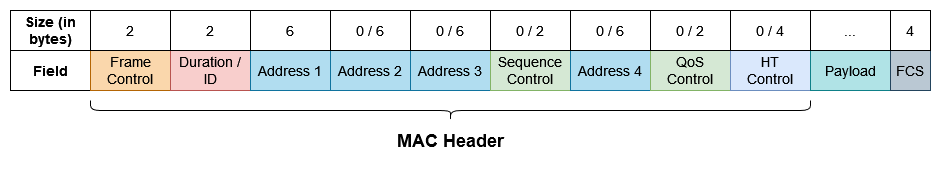
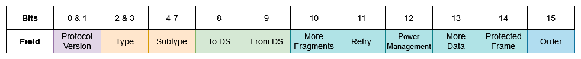

# Introduction
The IEEE 802.11 standard defines the structure of datalink frames in wireless networks. These frames have a more complicated structure that [Ethernet](Ethernet%20(IEEE%20802.3).md) ones.

The existence of the last 6 fields in the MAC header is contingent on the type of the frame.

## Frame Control
The Frame Control is a 2-byte field, subdivided into 11 subfields, which carries information about the WiFi frame, including its type. 

The Protocol Version is 2 bits long and is set to 00 for PV0 (WLAN) or to 01 for PV1 (802.11ah). The revision level is incremented only when there is a fundamental incompatibility between two versions of the standard.

The Type is a 2-bit field which indicates the type of the frame. There are three main times of frames in 802.11 and the values corresponding to each type are the following:

|Value|Type|
|:-----:|:----:|
| `00` | Management |
| `01` | Control |
| `10` | Data |
| `11` | Extension |

Each frame type has its own subtypes and the particular one for the frame is specified in the 4-bit Subtype field. 

Following are the *To Distribution System (ToDS)* and the *From Distribution System (FromDS)* 1-bit fields. They indicate whether traffic is travelling from or to the [Distribution System](../The%20TCP-IP%20Suite%20and%20the%20OSI%20Model/(1)%20The%20Physical%20Layer.md#the-distribution-system). However, it is really the combination of these bits that is interpreted as meaningful:

|To DS|From DS|Meaning|
|:-----:|:--------:|:---------:|
|0|0|Station-to-station communication in an [IBSS](../The%20TCP-IP%20Suite%20and%20the%20OSI%20Model/(1)%20The%20Physical%20Layer.md#independent-basic-service-set-ibss). |
|0|1|Traffic from AP to station (exiting the DS).|
|1|0|Traffic from station to AP (entering the DS).|
|1|1|Traffic from AP to AP ([wireless bridging](../The%20TCP-IP%20Suite%20and%20the%20OSI%20Model/(1)%20The%20Physical%20Layer.md#workgroup-bridge)).|

Next is the More Fragments field. If a datagram was fragmented into multiple frames, this field will be set to 1 for all frames except the last one. 

Afterwards comes the Retry field. A value of 1 indicates that this frame is a *retransmission* of a frame which did not receive a confirmation (ACK).

The Power Management field is set to 1 if the station uses power saving mode, which means that periodically shuts down some of its components to preserve power. Frames with this bit set but no actual data are used to inform the AP of the station's power saving mode. The AP will then buffer frames intended for this client.

The More Data field indicates whether or not the AP has more buffered frames to send to a station in power saving mode. Receiving a frame with this bit set to 1 which cause the station to wait to receive all frames from the AP before proceeding with its power saving shenanigans. 

The Protected Frame bit is set to 1 when the payload of the frame is encrypted and is 0 otherwise. 

Finally, the Order bit should be set to 0 for all frames with the exception of non-QoS data frames. In this case, this bit indicates a request from a higher layer for the data to be sent using a strictly ordered Class of Service. This tells the receiving station to process the frames in order.

## Duration / ID
The Duration / ID is interpreted differently depending on the message type and can either serve as a duration or an association ID.

