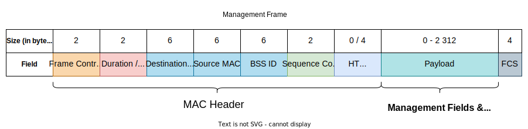
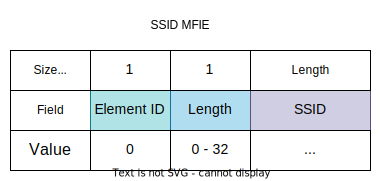

# Introduction
Management frames render the service of managing the Service Set. They have 3 addresses in their MAC header, which is 24 bytes in size for 802.11a/b/g/, and 28 bytes for 802.11n (additional 4 bytes for the HT Control field). Their type in the [Frame Control](../index.md#frame-control) is indicated by `00`. Moreover, management frames are never forwarded to the DS, so they have the `FromDS` and `ToDS` bits set to 0 in their Frame Control. 

The source and destination MAC addresses are self-explanatory. The third address is the BSS ID which can either be the MAC of the AP or a wildcard value (for probe requests). If 802.11n is used, there is also an HT Control field in the MAC header. The frame body (payload) is comprised of fixed-size fields and variable-size information elements.

There are 12 subtypes of management frames:

|Subtype Bits|Meaning|
|:------------:|:----------:|
|`0000`|Association Request|
|`0001`|Association Response|
|`0010`|Reassociation Request|
|`0011`|Reassociation Response|
|`0100`|Probe Request|
|`0101`|Probe Response|
|`1000`|Beacon Frame|
|`1001`|Announcement Traffic Indication Message (ATIM)|
|`1010`|Disassociation Frame|
|`1011`|Authentication Frame|
|`1100`|Deauthentication Frame|
|`1101`|Action Frame|
|`1110`|Action - no ACK|

# Management Frame Fields
These are fixed-size fields and are typically located at the beginning of the management frame's body.

## Capability Information
This is a complex 2-byte field which indicates request or advertised capabilities. This field is present in beacon, probe response, association request, association response, reassociation request, and reassociation response frames.

The `ESS` & `IBSS` fields are mutually exclusive. The ESS bit indicates whether the frame is coming from an AP (1) or not (0) and the IBSS fields indicates whether or not the frame is coming form an IBSS station (1) or not (0).

The `Privacy` field is set to 1 if data confidentiality (AES, TKIP, or WEP) is required and is set to 0 otherwise. The encryption type is actually determined by the RSN field.

`Short Preamble` is set to 1 if short preambles are supported.

`Channel Agility` is an optional feature introduced by 802.11b. Its purpose was to reduce interference by periodically shifting the channel up and down a bit but it was never widely adopted.

`Spectrum Management` is set to 1 to reflect DFS and TPC support.

`QoS` is set to 1 if the AP supports QoS and is seto to 0 otherwise.

`Short Slot Time` is used to indicate whether Short Slot Time (9 μs) is used. This indicates that 802.11b is not supported by the AP, since this standard only uses Standard Slot Time (20 μs). If an 802.11b client joins the network, Short Slot Time should be disabled across the entire network until the 802.11b device leaves. Thus, all following frames should have this bit set to 0. For 802.11a, this bit is always set to 0, since Standard Slot Time is not supported, so there is no "long" and therefore no "short" time.

If the `APSD` set is set to 1, then the AP supports the eponymous feature. If this is set to 0, then the AP only supports Legacy Power Saving Mode. Frames originating from client should always have this bit set to 0, due to network-wide nature of this feature.

`DSSS-OFDM` provides 54 Mbps speeds in 802.11b/g-  
compatible networks. When this bit is set to 1, the DSSS-OFDM mode is allowed.  
When the bit is set to 0, this mode is not allowed. This bit is always set to 0 for 802.11a networks.

## Status Code Field
This is a 2-byte long field present in Response frames. If set to 0, then the request was successful. Otherwise, the field contains the failure code, where 1 indicates an unspecified failure.

## Reason Code Field
This 2-byte field is used to indicate the reason that an unsolicited notification man-  
agement frame of type disassociation, deauthentication, DELTS, DELBA, or DLS teardown  
was generated. It is only present in frames of the above types when such a frame is sent to a station without the client asking.

# Management Frame Information Elements
Manage frames can contain Management Frame Information Elements which are variable-length components and they may or may not be present. The typical structure of an MFIE is an element ID, followed by a length, and then the actual payload. The element ID and the length fields are both 1 bytes long, while the payload may range from 0 to 32 bytes. 

The following Element IDs are defined:

|Element ID|Name|
|:-----------:|:----:|
|0| Service Set Identity (SSID) |
|1| Supported Rates |
|2| FH Parameter Set |
|3| DS Parameter Set |
|4| CF Parameter Set |
|5| Traffic Indication Map (TIM) |
|6| IBSS Parameter Set |
|7| Country |
|8| Hopping Pattern Parameters |
|9| Hopping Pattern Table |
|10| Request Information|
|11|BSS Load|
|12 - 15| Reserved |
|16| Challenge Text |
|17 - 31| Reserved |
|32| Power Constraint |
|33| Power Capability |
|34| Transmit Power Control (TPC) Request |
|35| TPC Report |
|36| Supported Channels |
|37| Channel Switch Announcement |
|38| Measurement Request |
|39| Measurement Report |
|40| Quiet |
|41| IBSS DFS |
|42|ERP Information |
|43 - 47| Reserved |
|48| Robust Security Network (RSN) |
|49| Reserved |
|50| Extended Supported Rates |
|51 - 220| Reserved |
|221| WPA |
|222 - 255| Reserved |

## SSID
The SSID element is present in all beacons, probe requests, probe responses, association  
requests, and reassociation requests. It has an Element ID of 0. Its length is the length of the SSID string. The SSID string is encoded one character per byte and has a maximum length of 32.

## Supported Rates & Extended Supported Rates
This element is present in beacons, probe requests, probe responses, and all  
association frames. Its component is comprised of a maximum of 8 bytes where each byte describes a single supported rate. Each rate takes the following format in a byte. The last bit is set to 1 if the rate is basic (mandatory) and to 0 if there is simply support for it. The rest of the bits described the data rate in multiples of 500 Kbps. A station willing to join the network must support all the mandatory rates.

If there are more than 8 supported rates, then an Extender Rates Element is also present. This Element can describe up to 255 additional rates in the same fashion as the Supported Rates Element.

## Robust Security Network (RSN)
This element has an ID of 48. It is present in present in beacons, probe responses,  
association responses, and reassociation responses, and is utilised with WPA/2/3 in order to determine the authentication and encryption mechanism in use. RSN has several subfields and its length depends on the number of supported mechanisms.

The `Version` subfield is 2 bytes in length and always set to 1.

Next is the `Group Cipher Suite` descriptor. The first three bytes are an OUI of the vendor (`00:0F:AC` for 802.11) and the last byte is the suite type. Following is a table of the cipher suites.

|OUI|Suite Type|Description|
|:--:|:-----------:|:-----------:|
|`00:0F:AC`|0|Use the group cipher suite (for pairwise ciphers only).|
|`00:0F:AC`|1|WEP-40|
|`00:0F:AC`|2|TKIP|
|`00:0F:AC`|3|Reserved|
|`00:0F:AC`|4|CCMP-128|
|`00:0F:AC`|5|WEP-104|
|`00:0F:AC`|6|BIP-CMAC-128|
|`00:0F:AC`|7|Reserved|
|`00:0F:AC`|8|GCMP-128|
|`00:0F:AC`|9, 10|GCMP-256|
|`00:0F:AC`|11|BIP-GMAC-128|
|`00:0F:AC`|12, 13|BIP-GMAC-256|

Next is a 2-byte `Pairwise Cipher Suite Count` which indicates how many ciphers are in the next field. Each cipher is described by 4 bytes in the `Pairwise Cipher Suite List`.

The next two fields are similar to the Pairwise Cipher Suite fields, but describe the mechanisms supported for authentication (Authentication & Key Management). The `AKM Suite Count` defines the number of methods supported. Each method is described by 4 bytes in the `AKM Suite List`, where the first 3 bytes are again an OUI. 

|OUI|Suite Type|Authentication|
|:--:|:-----------:|:-----------:|
|`00:0F:AC`|1|802.1X or PMK Caching|
|`00:0F:AC`|2|Pre-shared Key (PSK)|
|Vendor OUI|Any|Vendor-specific|

The `RSN Capabilities` is a 2-byte field. The first 4 bits are flags and the rest must be set to 0. The `Preauthentication` bit is set by an AP to indicate that it supports preauthentication with other APs in order to move security sessions around. The `No Pairwise` bit is set station can support a manual WEP key for broadcast data in conjunction with a stronger unicast key, but this should not be used. 

The last two fields, `PMKID Count` and `PMKID List`, describe a list of PMKs which a client may send to an AP during association in order to speed up the process by bypassing time-consuming authentication. This only works if the AP caches PMKs. 

## Direct Sequence (DS) Parameter Set
The DS Parameter Set element in used both by DSSS and OFDM system, on both 2.4 GHz and 5 GHz bands. It is a simple field with an important task - it indicates the current channel.

Since 802.11 signals are spread across multiple channel, this indicates the channel that the sender is centering their transmission on.
When 802.11n is employed with channel bonding, the secondary channel is indicated in several 802.11n-specific field such as the Secondary Channel element or the 20/40 IBSS Coexistence element.

## BSS Load
This element is used only when QoS is supported (when the QoS subfield in the Capability  
Information element is enabled) and is often additionally called QBSS Load. It provides information about the network load and is typically sent by APs. Stations avail themselves of this field in order to determine how to [roam](../../../The%20TCP-IP%20Suite%20and%20the%20OSI%20Model/(1)%20The%20Physical%20Layer.md#extended-service-set-ess).

The `Station Count` is an integer indicating the number of stations currently connected to the network.

The `Channel Utilisation` field is the percentage of time, normalised to 255, that the AP sensed the medium was busy. An AP senses the medium every slot time. At regular inter- vals (every 50 beacons by default)), the AP looks over the last period and counts how many times the  
network was seen as busy and how many times it was seen as idle. A simple percentage is then calculated and translated into a 0 to 255 range.

## Enhanced Distributed Channel Access (EDCA) Parameter
This element is used only when QoS is supported. In most QoS-enabled networks, this  
field is not used, and the same information is provided through the WMM or the WME  
vendor-specific elements.

## QoS Capability
This element is used only when QoS is supported. It is used as a conjugate to the EDCA  
Parameter element when EDCA Parameter is not present. Furthermore, It is utilised by the AP to transmit QoS information to the network. It is a shorter version of the EDCA Parameter Set  
element and contains only the QoS information section. In most QoS-enabled networks,  
this field is not used, and the same information is provided through the WMM or the  
WME vendor-specific elements.

## IBSS DFS
IBSSs require a designated owner for the dynamic frequency selection (DFS) algorithm. Thus, this element may be transmitted by management frames in an IBSS.

The `DFS Owner` field contains the MAC address of the, well, DFS owner. Should this owner disappear or be lost during a hop, the `DFS Recovery Interval` will contain a timeout (in TBTTs or beacon intervals) for how long a station not hearing from the DFS owner should wait before selecting its own channel and assuming the role of a DFS owner itself.

The last field is a `Channel Map` which is a series of members which report what is detected on each channel. A channel map member consists of two bytes - one for the channel number and one for the actual information.

The latter byte is split into five subfields - the last three bits are reserved. The `BSS` bit will be set to 1 if frames from another network are detected during a measurement period. The `OFDM Preamble` bit is set if the 802.11a short training sequence is detected, but without being followed by the rest of the frame. The `Unidentified Signal` bit is set to 1 when the received power is high, but the signal cannot be classified as either a 802.11 network, an OFDM network, or a radar signal. The `Radar` bit is set to 1 if a radar signal was received during the measurement period. The `Unmeasured` bit is set to 1 if the channel wasn't measured. In this case, all other bits will naturally be 0.

## Country
Since each country is allowed to regulate the allowed channels and power levels, a mechanism was invented for networks to describe these limitations to new stations instead of ceaselessly updating drivers.

The `Country String` is a 3-byte ASCII string representing the country of operation. The first two characters are the country's ISO code and the last character is either set to "I" or "O" which distinguishes between indoor and outdoor regulations, respectively.

The rest of the country MFIE is composed of `Constraint Triplets`. The `First Channel` field signifies the lowest channel subject to the power constraint. Next is the `Number of Channels` in the band that are subject to the power constraint. Ultimately comes the `Max Transmit Power` which indicates the maximum transmission power allowed, in dBm.

The size of the information element must be an even number. Otherwise, a `Padding` byte full of 0s is appended.

## Power Constraint
Under 802.11h, stations operating in the 5 GHz bands should reduce their power level so as to avoid creating interference with other devices using the same spectrum. This is referred to as "satellite services", but is so far implemented only to avoid interference with civilian airport radars in the UNII-2 and UNII-2 extended bands. In this field, the AP indicates how much lower than the maximum power indicated by the Country element participants should strive for.

The `Local Power Constraint` field is the reduction of power, in dBm, from the one in the Country element that stations should strive for. If the Country element designated 10 dBm as the maximum and this field contains 4 dBm, then the stations should ultimately strive for a signal power of 6 dBm.

## Power Capability
This field allows a station to report its minimum and maximum transmission power in dBm.

## TPC Report
The attenuation of the link is useful to stations seeking to adjust their transmission power. This field typically serves as a response to a [TPC Request](Discovery%20Frames.md#tpc-request). 

The `Transmit Power` indicates the transmission power, in dBm, used to transmit the frame containing the element. The `Link Margin` is another field which contains the number of decibels that are required by the sending station for safety.

## Supported Channels
This field describes the channel sub-bands supported by the device. After the element header follows a series of *sub-band descriptors*. The first member of the descriptor is the lowest channel supported in the sub-band. The second subfield describes the number of supported channels, beginning with the `First Channel`.

If a station supported channels 20 through 36, then it would have the above fields set to 20 and 16, respectively.

## Channel Switch Announcement
With the advent of 802.11h, a feature for dynamic channel switching was implemented. Therefore, management frames may include this element in order to warn stations about the impending channel switch.

When the channel is switched, communications are disrupted. If the `Switch Mode` is set to 1, then associated stations should cease transmission until the switch occurs. If set to 0, no restrictions are placed on transmission.

The `New Channel` field indicates the number of the channel to switch to.

Channel switching can be scheduled. The `Switch Count` indicates the number of [TBTTs](Discovery%20Frames.md#beacon-frames) that it will take before the channel is changed. The channel switch occurs at the nick of time before the [beacon frame](Discovery%20Frames.md#beacon-frames) is sent. If this field is set to 0, then the channel switch may occur without further warning.

## Quiet
Under 802.11h, an AP can request a period of silence during which no station should transmit. This is done in order to detect possible radars and then possible issue a channel switch if such is found.

Silence periods are scheduled. The `Quiet Count` field contains the number of [TBTTs](Discovery%20Frames.md#beacon-frames) before the quiet period is to occur.

Moreover, silence periods may be scheduled periodically. The `Quiet Period` field indicates the number of [beacon intervals](Discovery%20Frames.md#beacon-interval) between silence periods. If this field is set to 0, then the silence period is not periodical.

The `Quiet Duration` field specifies the number of time units that the silence period will last.

The `Quiet Offset` field is the number of time units after a [beacon interval](Discovery%20Frames.md#beacon-interval) that the silence period is to begin at.