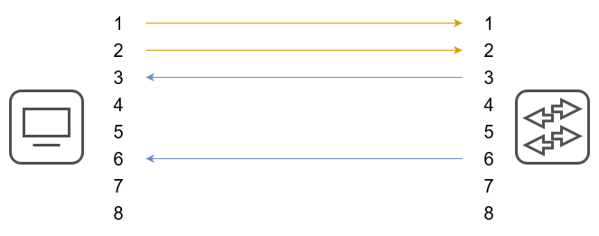
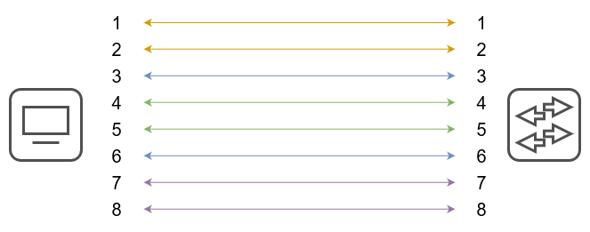
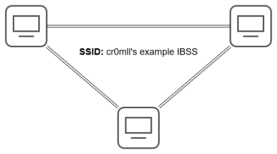

# Introduction
The Physical layer is the lowest layer in the OSI model. It provides the electrical, mechanical, or electromagnetic means by which data is physically transferred between hosts. At the core of the Physical layer lie interfaces and mediums. Interfaces are what allow devices to send receive data, while mediums are what the data travels through between interfaces. Data at the physical layer is transmitted in *bits*, not bytes, hence why internet speeds are typically measured in multiples of bits per seconds or bps.

# Mediums
## Copper (UTP) Cables
The following standards are defined for copper cable Ethernet:

|Speed|Common Name|IEEE Standard|Informal Name|Max Length|
|:-----:|:---------------:|:-------------:|:--------------:|:------------:|
| 10 Mbps| Ethernet | 802.3i | 10BASE-T| 100m |
| 100 Mbps| Fast Ethernet | 802.3u | 100BASE-T| 100m |
| 1 Gbps| Gigabit Ethernet | 802.3ab | 1000BASE-T| 100m |
| 10 Gbps| 10 Gig Ethernet | 802.3an | 10GBASE-T| 100m |

In the above nomenclature, `BASE` refers to baseband signaling, while `T` indicates *twisted pair*.

The copper cables described by the above standards are *Unshielded Twisted Pair* (UTP) cables which comprise 4 pairs of 8 wires.

"Unshielded" means that the wires lack a metallic shield which increases their susceptibility to electrical interference. The "twisted pair" part is pretty self-explanatory and serves the purpose of reducing electromagnetic interference.

The RJ-45 jacks used for Ethernet have 8 pins - one pin per wire - however, not all pins are in use by all standards. 10BASE-T and 100BASE-T avail themselves only of pins 1, 2, 3, and 6. Moreover, different devices use these pins differently. Switches utilise pins 3 and 6 for *transmitting* (Tx) data and use pins 1 and 2 for *receiving* (Rx) data. This separation allows for *full-duplex* transmission - the device is able to both receive and send data at the same time. Most other devices, however, such as PCs, routers, and firewalls do the opposite - they use pins 3 and 6 for receiving and use pins 1 and 2 for sending data.

The above is a diagram of a *straight-through cable*, since there is a one-to-one correspondence between the pins. This is a simple approach, but unfortunately only works when devices of opposite types are being connected - you can't use it to connect a router to another router, a switch to another switch, or a PC to another PC. This is where *crossover cables* come. In these cables, different pins on one end correspond to different pins on the other.

|Device Type|Tx Pins|Rx Pins|
|:-----------:|:-----:|:------:|
|Router|1 and 2|3 and 6|
|Firewall|1 and 2|3 and 6|
|PC|1 and 2|3 and 6|
|Switch|3 and 6|1 and 2|

Most modern devices, however, support a feature called Auto MDI-X. This allows them to detect which pins their neighbour is transmitting data on and automatically adjust their own use of Tx and Rx pins to allow for proper communication. This makes the use of different types of cables often obsolete.

Higher speed standards avail themselves of all the pins. Additionally, in 1000BASE-T and 10GBASE-T are bidirectional and allow for both transmission and reception which allows for greater speeds.

## Fibre-Optic Cables
Fibre-Optic cables are a new generation of cables. Instead of transferring electrical signals through copper wiring, these cables conduct signals in the form of *light*, which makes them immune to EMI. In order to use fibre-optics, a special type of connector called SFP is required, which is short for *Small Form-Factor Pluggable* and looks like this:

Data is transferred through the fibre-optic cable which has two connections on each end - one for sending and one for receiving:

The fibre-optic cable is comprised of 4 main layers. The innermost layer is the fibreglass core, which is what the light travels through. This core is enveloped in a cladding layer which reflects the light beam travelling through the cable. Around the cladding is a protective buffer, which is in turn wrapped in the outer jacket.

There are two main types of fibre-optic cables in the wild. The first type is multi-mode fibre which allows for light to enter at multiple angles. It has a larger glass core and allows for a greater transmission distance than UTP and is also cheaper than single-mode fibre. Single-mode fibre, on the other hand allows for light to enter only at a single angle, called a *mode*, and has a much greater maximum distance than that of multi-mode (step index).

The following fibre-optic cable standards are defined:

| Informal Name | IEEE Standard | Speed | Cable Type | Maximum Length |
|:-----------------:|:---------------:|:-------:|:------------:|:--------------------:|
| 1000BASE-LX | 802.3z | 1 Gbps | Multi- or single-mode | 550 m (MM), 5 km (SM) |
| 10GBASE-SR | 802.3ae | 10 Gbps | Multi-mode | 400 m |
| 10GBASE-LR | 802.3ae | 10 Gbps | Single-mode | 10 km |
| 10GBASE-ER | 802.3ae | 10 Gbps | Single-mode | 30 km |

## Wireless (WiFi)
Wireless LANs (WLANs) use electromagnetic radiation for the transfer of data. The standards WLANs are defined in IEEE 802.11. Although commonly called "WiFi", this is actually a trademark of the *WiFi Alliance* which certifies devices for compliance with the IEEE 802.11 standards, but is not directly connected with it.

A corollary of WiFi's using radio waves to transmit data is that *all* devices within range receive *all* frames. It is, therefore, paramount that this data is encrypted. Furthermore, due to the fact that multiple devices will be using the same frequency ranges to transmit data, it is of the utmost importance that collisions are avoided. This is typically actuated by *CSMA/CA* - Carrier Sense Multiple Access will Collision Avoidance. Essentially, when this technique is in use, the device will wait for the channel to be free before transmitting any data by checking it periodically. An additional feature is also supported whereby the device will send a Request-To-Send (RTS) packet and will wait for a Clear-To-Send (CTS) response.

WiFi uses 3 major *frequency bands (ranges)*. The first is 2.4 GHz and it covers the frequencies from 2.400 GHz to 2.4835 GHz. Next is the 5 GHz band which ranges from 5.150 GHz to 5.825 GHz and is further subdivided into 4 smaller bands - from 5.150 to 5.250 GHz, from 5.250 to 5.350, from 5.470 to 5.725, and from 5.725 to 5.825. The last band is the 6 GHz band and it was introduced with WiFi 6.

While 2.4 GHz provides further reach and better obstacle penetration, it is typically used by more devices and may have higher interference than 5 or 6 GHz.

Each band is divided into *channels* with a different width. 2.4 GHz is comprised of 13 channels, each of width 22 MHz although this may depend on your country. These channels may overlap with each other, so it is crucial that non-overlapping ones are chosen for the access points in a certain area to avoid interference. A typical configuration is to use channels 1, 6, and 11 in a honeycomb pattern, since those channels have no overlap with each other.

There are a few standards defined in IEEE 802.11:

|Standard|Frequencies|Max Speed|Name|
|:---------:|:------------:|:-----------:|:-------:|
|802.11|2.4 GHz|2 Mbps| |
|802.11b|2.4 GHz|11 Mbps| |
|802.11a|5 GHz|54 Mbps| |
|802.11g|2.4 GHz|54 Mbps| |
|802.11n|2.4 GHz / 5 GHz|600 Mbps| Wi-Fi 4|
|802.11ac|5 GHz|6.93 Gbps| Wi-Fi 5|
|802.11ax|2.4 GHz / 5 GHz / 6 GHz|`4 * 802.11ac`| Wi-Fi 6|

## Service Sets
The IEEE 802.11 standard also defines a different kinds of *service sets*. These are groups of wireless network devices and are organised into three main types:
- Independent
- Infrastructure
- Mesh

All devices in a service set share the same *service set identifier (SSID)*. This is a human-readable name which does *not* have to be unique. Following is an example of the SSIDs visible to my current device.

### Independent Basic Service Set (IBSS)
An IBSS is a wireless network in which a small number of wireless devices are connected directly to each other without an access point. It is also commonly referred to as an *ad hoc network*. It can be useful for some tasks such as small file transfers (i.e. AirDrop), but is not scalable beyond a few devices.

### Basic Service Set (BSS)
A BSS is a network infrastructure in which the clients are all connected to an access point, but not to each other. All traffic must go through the AP, even if two devices that want to communicate are within range of one another. A BSS is characterised by a *Basic Service Set ID (BSSID)* and an SSID. The former is the MAC address of the AP and must be unique, while the latter may be shared across multiple access points.

In order to connect to a BSS, wireless devices request to be *associated* with it. Once a device has been associated with an access point, it is referred to as a *station*.

The area around an AP where its signal is usable is typically called a *Basic Service Area (BSA)*.

### Extended Service Set (ESS)
For the creation of larger WLANs, which span more than the range of a single AP, an *Extended Service Set (ESS)* is utilised. In it, multiple APs are connected by a wired network. Each BSS shares the same SSID, but has a unique BSSID. Furthermore, the BSSs use different channels in order to avoid interference. 

Clients are able to pass between APs without the need to reconnect, which is referred to as *roaming*. In order to ensure as seamless an experience as possible, the BSAs should overlap ~10-15%.

### Mesh Basic Service Set (MBSS)
An MBSS is employed when difficulties arise with running a direct Ethernet connection through every AP. Mesh access points utilise two radios - one for the provision of a BSS to the wireless clients and one for inter-AP communication, called a *backhaul network*. At least one AP must be connected to the wired network and it is referred to as *Root Access Point (RAP)*. The rest of the APs are called *Mesh Access Points (MAPs)*. A protocol is employed to determine the best path for traffic in the MBSS.

