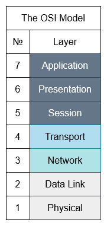
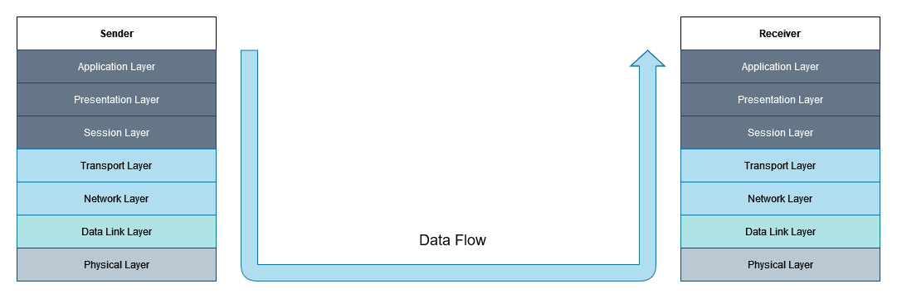

# The OSI Model
The OSI model is a conceptual protocol model which groups different protocols into *layers*, based on their function. Each layer is in turn only allowed to communicate with the layers immediately above and below it, taking data from the previous layer, processing it in some way and then forwarding it to the next layer. There are 7 layers in the OSI model and together they form the layer stack:

When data is sent from a device, this data is processed in each layer from top to bottom. Furthermore, each layer may augment the actual data transmitted by adding *headers* to the data.

At the site of arrival, data processing occurs in the reverse order. Each layer processes the corresponding header and acts upon it. Once it's done with its job, it forwards the remaining information up to the above layer. It's just like peeling an onion!

## The Application Layer
Here reside the myriad network applications and their application-layer protocols, such as HTTP, FTP, and SMTP. These are all tailored to the network application and serve very specific purposes. It is relatively easy to also develop and implement your own application-layer protocols. Pakcets of information at this layer are referred to as *messages*.

## The Presentation layer
The presentation layer is responsible for formatting and rendering data into an appropriate format. It handles data compression and decompression, encryption and decryption. Furthemore, it deals with the cross-OS compatibility of data. In other words, it describes how data should be *presented* to the application layer.

## The Session Layer
The session layer sets up, maintains, synchronises, and terminates the communication between different hosts. It includes functionality for user logon, authentication, management and logoff. Common protocols are ADSP, PPTP, and PAP.

## The Transport Layer
This layer provides the means through which messages are transmitted between endpoints. It provides services for addressing, message delivery, flow control and multiplexing. The two protocols which dominate this layer are TCP and UDP. Packets at this layer are known as *segments*.

## The Network Layer
Network-layer packets are called *datagrams* and this layer is responsible for moving these datagrams from host to host. It is provided with a source and destination address from the transport layer and then send the datagram on its path to the destination. Here resides the famous IP protocol, together with different routing protocols such as ICMP and DDP.

## The Data Link Layer
The data link (or just link) layer handles the transmition of *frames* between nodes as the packets are being routed to their destination. Protocols which fall in this layer are Wi-Fi, Ethernet, PPP and DOCSIS. This is where MAC and LLC reside.

## The Physical Layer
This layer takes on the job of transmitting individual bits from frames through physical links such as coaxial cable or fibre-optic cables. The protocols here vary depending on the medium used.

# The TCP/IP Suite
Similarly to the OSI model, the TCP/IP Suite is another conceptual networking model. Its names stems from two of the main protocols it is based on - TCP and IP - and was developed by the United States Department of Defence through a programme called DARPA. Its structure resembles that of the OSI model but has fewer layers. While this is the model used in modern networks, OSI still has a large influence on how networks are perceived and developed and most layer terminology actually refers to OSI, since there is an equivalence between OSI's layers and the layers of the TCP/IP Suite.

