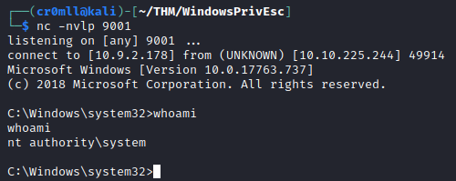

# Unquoted Service Paths
This is a vulnerability which can be used to force a misconfigured service to execute an arbitrary programme in lieu of its intended one, as long as the path to that executable contains spaces. On its own, this does not allow for privilege escalation, but it becomes a really powerful tool when the misconfigured service is set to run with system privileges.

Let's take a look at the following path:
```
C:\Program Files\Vulnerable Service\service.exe
```

If this path was specified to the service in quotation marks, `"C:\Program Files\Vulnerable Service\service.exe"`, then Windows will treat it correctly, executing the `service.exe` file in the `C:\Program Files\Vulnerable Service` directory.

However, Windows is not the sharpest tool in the box and if the path is provided without quotation marks, then it will see ambiguity in what it is supposed to execute. The path will be split at each space character - the first segment will be treated as the executable's name and the rest will be seen as command-line arguments to be passed to it. So at first, Windows will try to execute the following:
```powershell
C:\Program.exe Files\Vulnerable Service\service.exe
```

Once Windows determines that the `C:\Program.exe` file does not exist, it will look for the next space character, treat the characters up to it as the new path and try to execute it again:
```powershell
C:\Program Files\Vulnerable.exe Service\service.exe
```

Now, this is process is recursive until a file is successfully executed or the end of the path has been reached. If we are able to create a malicious executable in any of the possible paths that Windows will attempt to execute, then we can hijack the service before the intended file is found.

Once you have identified a vulnerable service, you can query to confirm that the path is indeed in unquoted.


Let's check our access to the possible directories that will be probed by Windows:
```powershell
accesschk.exe /accepteula -uwdq <directory>
```


While we cannot write within the `C:\` or `C:\Program Files` directories (meaning that we cannot create `C:\Program.exe` or `C:\Program Files\Unquoted.exe`), we do have write access to `C:\Program Files\Unquoted Path Service\`. What this entails is our ability to create a `Common.exe` binary inside this directory and, since the initial path was unquoted, the path `C:\Program Files\Unquoted Path Service\Common.exe` will be probed before `C:\Program Files\Unquoted Path Service\Common Files\unquotedpathservice.exe` and once Windows finds our malicious executable there, it will be executed with the service's permissions.


If we couldn't restart the service, then we could have simply waited for something else to execute it.


