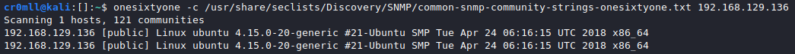

# Introduction
You will need working knowledge of [SNMP](../../Networking/Protocols/Simple%20Network%20Management%20Protocol%20(SNMP).md) in order to follow through.

# SNMP Enumeration using `snmp-check`
`snmp-check` is a simple utility for basic SNMP enumeration. You only need to provide it with the IP address to enumerate:

```
snmp-check [IP]
```

Furthermore, you have the following command-line options:
- `-p`: Change the port to enumerate. Default is 161.
- `-c`: Change the community string to use. Default is `public`
- `-v`: Change the SNMP version to use. Default is v1.

There are additional arguments that can be provided but these are the salient ones.


# SNMP Enumeration using `snmpwalk`
`snmpwalk` is a much more versatile tool for SNMP enumeration. It's syntax is mostly the same as `snmp-check`:


# Bruteforce community strings with `onesixtyone`
Notwithstanding its age, `onesixtyone` is a good tool which allows you to bruteforce community strings by specifying a file instead of a single string with its `-c` option. It's syntax is rather simple:


