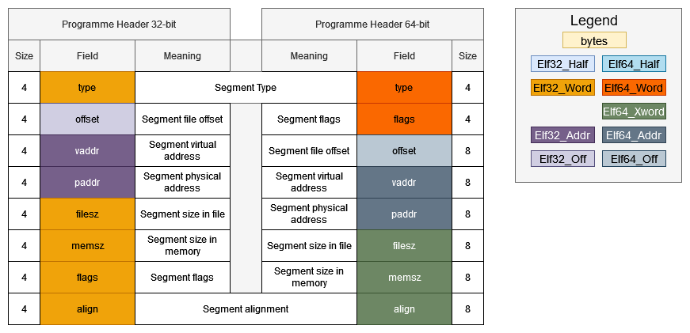

# Introduction
Segments split the ELF binary into parts which are then loaded into memory by the OS programme loader. They can be thought of as grouping sections by their attributes and only selecting those which will be loaded into memory. In essence, segments contain information needed at runtime, while sections contain information needed at link-time. 

# The Programme Header Table
Segments are described by *programme headers* which are stored in the Programme Header Table (PHT). These structs are again defined in `<elf.h>`:

```cpp
typedef struct
{
  Elf32_Word	p_type;			/* Segment type */
  Elf32_Off	    p_offset;		/* Segment file offset */
  Elf32_Addr	p_vaddr;		/* Segment virtual address */
  Elf32_Addr	p_paddr;		/* Segment physical address */
  Elf32_Word	p_filesz;		/* Segment size in file */
  Elf32_Word	p_memsz;		/* Segment size in memory */
  Elf32_Word	p_flags;		/* Segment flags */
  Elf32_Word	p_align;		/* Segment alignment */
} Elf32_Phdr;

typedef struct
{
  Elf64_Word	p_type;			/* Segment type */
  Elf64_Word	p_flags;		/* Segment flags */
  Elf64_Off	    p_offset;		/* Segment file offset */
  Elf64_Addr	p_vaddr;		/* Segment virtual address */
  Elf64_Addr	p_paddr;		/* Segment physical address */
  Elf64_Xword	p_filesz;		/* Segment size in file */
  Elf64_Xword	p_memsz;		/* Segment size in memory */
  Elf64_Xword	p_align;		/* Segment alignment */
} Elf64_Phdr;
```



- `p_type` - describes the type of the segment.
- `p_offset` - the offset from the beginning of the file where the segment resides.
- `p_vaddr` - the virtual address at which the segment resides in memory.
- `p_paddr` - the segment's physical address, which is relevant only for systems with physical addressing. This member holds unspecified contents for executables and shared objects
- `p_filesz` - the number of bytes the segment occupies in the file image. It may be 0.
- `p_memsz` - the number of bytes the segment occupies in the memory image. It may be 0.
- `p_align` - the value to which the segments are aligned in the file and in memory. If this holds 0 or 1, then no alignment is required. Otherwise, `p_align` should be a positive integer power of 2 and `p_vaddr` should be equal to `p_offset % p_align`.

The PHT can be viewed by specifying the `-l` argument to `readelf`:


# Segment Types
| Name       | Value      |
|------------|------------|
| `PT_NULL`    | 0          |
| `PT_LOAD`    | 1          |
| `PT_DYNAMIC` | 2          |
| `PT_INTERP`  | 3          |
| `PT_NOTE`    | 4          |
| `PT_SHLIB`   | 5          |
| `PT_PHDR`    | 6          |
| `PT_TLS`     | 7          |
| `PT_LOOS`    | 0x60000000 |
| `PT_HIOS`    | 0x6fffffff |
| `PT_LOPROC`  | 0x70000000 |
| `PT_HIPROC`  | 0x7fffffff |

## `PT_LOAD`
This specifies a loadable segment described by `p_filesz` and `p_memsz` which means the segment is going to be mapped into memory. Bytes from the file are mapped to the beginning of the memory segment. Should the memory size be larger than the file size, the extra bytes are filled with 0s and are placed after the segment's data. Note that the file size cannot be larger than the memory size. 

Entries of this type are sorted in an ascending order in the PHT according to their `p_vaddr` field.

All executable files must contain at least one `PT_LOAD` segment.

## `PT_DYNAMIC`
The dynamic segment is pertinent to executables which avail themselves of dynamic linking and contains information for the dynamic linker. It typically points to the `.dynamic` section and comprises a series of structures which hold the relevant information. 

```cpp
typedef struct
{
  Elf32_Sword	d_tag;			/* Dynamic entry type */
  union
    {
      Elf32_Word d_val;			/* Integer value */
      Elf32_Addr d_ptr;			/* Address value */
    } d_un;
} Elf32_Dyn;

typedef struct
{
  Elf64_Sxword	d_tag;			/* Dynamic entry type */
  union
    {
      Elf64_Xword d_val;		/* Integer value */
      Elf64_Addr d_ptr;			/* Address value */
    } d_un;
} Elf64_Dyn;
```

In essence, the `d_tag` field determines whether the `d_un` field is treated as a value or an address.

## `PT_NOTE`
This segment is completely optional and may contain information that is pertinent to a specific system. It can hold a variable number of entries of size 4 or 8 bytes on 32-bit and 64-bit platforms, respectively.

## `PT_INTERP`
Here are specified the location and size of a null terminated string which describes the programme interpreter. Only one such segment is allowed per file and it must also precede any `PT_LOAD` segments.

## `PT_PHDR`
This segment contains the location and size of the Programme Header Table itself, both in the file and in memory. Similarly to `PT_INTERP`, only one such segment is allowed per file and it must also precede any `PT_LOAD` segments.

## `PT_TLS`
This segment specifies the Thread-Local Storage template. The latter is an amalgamation of all sections of type `SHF_TLS`. TLS sections are used to specify the size and initial contents of data whose copies are to be associated with different threads of execution. The part of the TLS which holds this initialised data is referred to as the *TLS initialisation image*, while the rest of the template is comprised of one or more sections of type `SHF_NOBITS`.

| Member   | Value                                                  |
|----------|--------------------------------------------------------|
| `p_offset` | File offset of the TLS initialization image            |
| `p_vaddr`  | Virtual memory address of the TLS initialization image |
| `p_paddr`  | reserved                                               |
| `p_filesz` | Size of the TLS initialization image                   |
| `p_memsz`  | Total size of the TLS template                         |
| `p_flags`  | `PF_R`                                                   |
| `p_align`  | Alignment of the TLS template                          |

## Other Segments
`PT_SHLIB` is reserved but is unspecified, while values from `PT_LOOS` to `PT_HIOS` and from `PT_LOPROC` through `PT_HIPROC` are reserved for OS- and processor-specific semantics, respectively.

# Segment Flags
The `p_flags` field describes the permissions the segment is equipped with. It is important to note that the system may actually give more access than requested with the exception that a segment will never be assigned write permissions, unless explicitly requested:

| Flags          | Value | Exact                | Allowable            |
|----------------|:-----:|----------------------|----------------------|
| none           | 0     | All access denied    | All access denied    |
| `PF_X`           | 1     | Execute only         | Read, execute        |
| `PF_W`           | 2     | Write only           | Read, write, execute |
| `PF_W+PF_X`      | 3     | Write, execute       | Read, write, execute |
| `PF_R`           | 4     | Read only            | Read, execute        |
| `PF_R+PF_X`      | 5     | Read, execute        | Read, execute        |
| `PF_R+PF_W`      | 6     | Read, write          | Read, write, execute |
| `PF_R+PF_W+PF_X` | 7     | Read, write, execute | Read, write, execute |