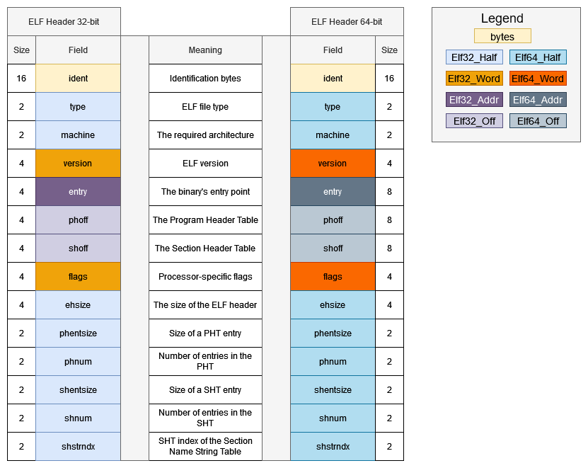

# Introduction
The ELF header is a data structure which sits at the beginning of every ELF file and describes its layout. It starts with 16 identification bytes that contain the ELF magic bytes. The following structs are defined in `<elf.h>`:

```cpp
#define EI_NIDENT 16

typedef struct {
        unsigned char   e_ident[EI_NIDENT];
        Elf32_Half      e_type;
        Elf32_Half      e_machine;
        Elf32_Word      e_version;
        Elf32_Addr      e_entry;
        Elf32_Off       e_phoff;
        Elf32_Off       e_shoff;
        Elf32_Word      e_flags;
        Elf32_Half      e_ehsize;
        Elf32_Half      e_phentsize;
        Elf32_Half      e_phnum;
        Elf32_Half      e_shentsize;
        Elf32_Half      e_shnum;
        Elf32_Half      e_shstrndx;
} Elf32_Ehdr;

typedef struct {
        unsigned char   e_ident[EI_NIDENT];
        Elf64_Half      e_type;
        Elf64_Half      e_machine;
        Elf64_Word      e_version;
        Elf64_Addr      e_entry;
        Elf64_Off       e_phoff;
        Elf64_Off       e_shoff;
        Elf64_Word      e_flags;
        Elf64_Half      e_ehsize;
        Elf64_Half      e_phentsize;
        Elf64_Half      e_phnum;
        Elf64_Half      e_shentsize;
        Elf64_Half      e_shnum;
        Elf64_Half      e_shstrndx;
} Elf64_Ehdr;
```



- `e_ident` - the initial magic bytes which denote an ELF file.
- `e_type` - the type of the object file. 

| Name | Value | Meaning |
|:-----:|:----:|:--------:|
| `ET_NONE` | 0 | Unknown |
| `ET_REL` | 1 | Relocatable file |
| `ET_EXEC` | 2 | Executable file |
| `ET_DYN` | 3 | Shared object file |
| `ET_CORE` | 4 | Core file |
| `ET_LOOS` | `0xfe00` | Operating system-specific |
| `ET_HIOS` | `0xfeff` | Operating system-specific |
| `ET_LOPROC` | `0xff00` | Processor-specific |
| `ET_HIPROC` | `0xffff` | Processor-specific |
- `e_machine` - specifies the required architecture. Values not labeled in the table are reserved for future machine names.

| Name           | Value | Meaning                                               |
|----------------|:-----:|-------------------------------------------------------|
| `EM_NONE`        | 0     | No machine                                            |
| `EM_M32`         | 1     | AT&amp;T WE 32100                                     |
| `EM_SPARC`       | 2     | SPARC                                                 |
| `EM_386`         | 3     | Intel 80386                                           |
| `EM_68K`         | 4     | Motorola 68000                                        |
| `EM_88K`         | 5     | Motorola 88000                                        |
| reserved       | 6     | Reserved for future use (was EM_486)                  |
| `EM_860`         | 7     | Intel 80860                                           |
| `EM_MIPS`        | 8     | MIPS I Architecture                                   |
| `EM_S370` | 9     | IBM System/370 Processor                              |
| `EM_MIPS_RS3_LE` | 10    | MIPS RS3000 Little-endian                             |
| reserved | 11-14 | Reserved for future use                               |
| `EM_PARISC` | 15    | Hewlett-Packard PA-RISC                               |
| reserved | 16    | Reserved for future use                               |
| `EM_VPP500` | 17    | Fujitsu VPP500                                        |
| `EM_SPARC32PLUS` | 18    | Enhanced instruction set SPARC                        |
| `EM_960` | 19    | Intel 80960                                           |
| `EM_PPC` | 20    | PowerPC                                               |
| `EM_PPC64` | 21    | 64-bit PowerPC                                        |
| `EM_S390` | 22    | IBM System/390 Processor                              |
| reserved | 23-35 | Reserved for future use                               |
| `EM_V800` | 36    | NEC V800                                              |
| `EM_FR20` | 37    | Fujitsu FR20                                          |
| `EM_RH32` | 38    | TRW RH-32                                             |
| `EM_RCE` | 39    | Motorola RCE                                          |
| `EM_ARM` | 40    | Advanced RISC Machines ARM                            |
| `EM_ALPHA` | 41    | Digital Alpha                                         |
| `EM_SH` | 42    | Hitachi SH                                            |
| `EM_SPARCV9` | 43    | SPARC Version 9                                       |
| `EM_TRICORE`     | 44    | Siemens TriCore embedded processor                    |
| `EM_ARC`         | 45    | Argonaut RISC Core, Argonaut Technologies Inc.        |
| `EM_H8_300`      | 46    | Hitachi H8/300                                        |
| `EM_H8_300H`     | 47    | Hitachi H8/300H                                       |
| `EM_H8S`         | 48    | Hitachi H8S                                           |
| `EM_H8_500`      | 49    | Hitachi H8/500                                        |
| `EM_IA_64`       | 50    | Intel IA-64 processor architecture                    |
| `EM_MIPS_X`      | 51    | Stanford MIPS-X                                       |
| `EM_COLDFIRE`    | 52    | Motorola ColdFire                                     |
| `EM_68HC12`      | 53    | Motorola M68HC12                                      |
| `EM_MMA`         | 54    | Fujitsu MMA Multimedia Accelerator                    |
| `EM_PCP`         | 55    | Siemens PCP                                           |
| `EM_NCPU`        | 56    | Sony nCPU embedded RISC processor                     |
| `EM_NDR1`        | 57    | Denso NDR1 microprocessor                             |
| `EM_STARCORE`    | 58    | Motorola Star\*Core processor                          |
| `EM_ME16`        | 59    | Toyota ME16 processor                                 |
| `EM_ST100`       | 60    | STMicroelectronics ST100 processor                    |
| `EM_TINYJ`       | 61    | Advanced Logic Corp. TinyJ embedded processor family  |
| `EM_X86_64`      | 62    | AMD x86-64 architecture                               |
| `EM_PDSP`        | 63    | Sony DSP Processor                                    |
| `EM_PDP10`       | 64    | Digital Equipment Corp. PDP-10                        |
| `EM_PDP11`       | 65    | Digital Equipment Corp. PDP-11                        |
| `EM_FX66`        | 66    | Siemens FX66 microcontroller                          |
| `EM_ST9PLUS`     | 67    | STMicroelectronics ST9+ 8/16 bit microcontroller      |
| `EM_ST7`         | 68    | STMicroelectronics ST7 8-bit microcontroller          |
| `EM_68HC16`      | 69    | Motorola MC68HC16 Microcontroller                     |
| `EM_68HC11`      | 70    | Motorola MC68HC11 Microcontroller                     |
| `EM_68HC08`      | 71    | Motorola MC68HC08 Microcontroller                     |
| `EM_68HC05`      | 72    | Motorola MC68HC05 Microcontroller                     |
| `EM_SVX`         | 73    | Silicon Graphics SVx                                  |
| `EM_ST19`        | 74    | STMicroelectronics ST19 8-bit microcontroller         |
| `EM_VAX`         | 75    | Digital VAX                                           |
| `EM_CRIS`        | 76    | Axis Communications 32-bit embedded processor         |
| `EM_JAVELIN`     | 77    | Infineon Technologies 32-bit embedded processor       |
| `EM_FIREPATH`    | 78    | Element 14 64-bit DSP Processor                       |
| `EM_ZSP`         | 79    | LSI Logic 16-bit DSP Processor                        |
| `EM_MMIX`       | 80    | Donald Knuth's educational 64-bit processor           |
| `EM_HUANY`       | 81    | Harvard University machine-independent object files   |
| `EM_PRISM`       | 82    | SiTera Prism                                          |
| `EM_AVR`         | 83    | Atmel AVR 8-bit microcontroller                       |
| `EM_FR30`        | 84    | Fujitsu FR30                                          |
| `EM_D10V`        | 85    | Mitsubishi D10V                                       |
| `EM_D30V`        | 86    | Mitsubishi D30V                                       |
| `EM_V850`        | 87    | NEC v850                                              |
| `EM_M32R`        | 88    | Mitsubishi M32R                                       |
| `EM_MN10300`     | 89    | Matsushita MN10300                                    |
| `EM_MN10200`     | 90    | Matsushita MN10200                                    |
| `EM_PJ`          | 91    | picoJava                                              |
| `EM_OPENRISC`    | 92    | OpenRISC 32-bit embedded processor                    |
| `EM_ARC_A5`      | 93    | ARC Cores Tangent-A5                                  |
| `EM_XTENSA`      | 94    | Tensilica Xtensa Architecture                         |
| `EM_VIDEOCORE`   | 95    | Alphamosaic VideoCore processor                       |
| `EM_TMM_GPP`     | 96    | Thompson Multimedia General Purpose Processor         |
| `EM_NS32K`       | 97    | National Semiconductor 32000 series                   |
| `EM_TPC`         | 98    | Tenor Network TPC processor                           |
| `EM_SNP1K`       | 99    | Trebia SNP 1000 processor                             |
| `EM_ST200`       | 100   | STMicroelectronics (www.st.com) ST200 microcontroller |

- `e_version` - specifies the ELF version.

| Name       | Value | Meaning         |
|------------|-------|-----------------|
| EV_NONE    | 0     | Invalid version |
| EV_CURRENT | 1     | Current version |

- `e_entry` - the virtual address of the entry point. If there is no entry point, this member is 0.
- `e_phoff` - the offset (in bytes) from the beginning of the ELF header for the Program Header Table. If the file does not contain such a table, this member is 0.
- `e_shoff` - the offset (in bytes) from the beginning of the ELF header for the Section Header Table. If the file does not contain such a table, this member is 0.
- `e_flags` - processor-specific flags which take values of the form `EF_flag_name`.
- `e_ehsize` - the size of the ELF header in bytes.
- `e_phentsize` - the size of an entry in the Program Header Table. All entries are equally-sized.
- `e_phnum` - the number of entries in the Program Header Table.
- `e_shentsize` - the size of an entry in the Section Header Table. All entries are equally-sized.
- `e_shnum` - the number of entries in the Section Header Table. If the number of sections is greater than or equal to `SHN_LORESERVE` (`0xff00`), this member is 0 and the actual number of entries in the Section Header Table is contained in the `sh_size` field of the first section header (at index 0). Otherwise, the `sh_size` member of the initial entry contains 0.
- `e_shstrndx` - the Section Header Table index of the entry which is associated with the section name string table. If there is no such table, this holds `SHN_UNDEF`.  If this index is greater than or equal to `SHN_LORESERVE` (`0xff00`), this member contains `SHN_XINDEX` (`0xffff`) and the actual index of the section name string table section is stored in the `sh_link` field of the first section header (at index 0). Otherwise, the `sh_link` member of the initial entry contains 0.

# ELF Identification
Since ELF supports multiple types of processors, data encodings and machines, the first 16 bytes provide information as to how to interpret the file, regardless of the rest of its contents. These are the indices and meaning of each identification byte (`e_ident`):

| Name          | Index | Purpose                             |
|---------------|:-----:|-------------------------------------|
| `EI_MAG0`      | 0     | File identification                 |
| `EI_MAG1`      | 1     | File identification                 |
| `EI_MAG2`      | 2     | File identification                 |
| `EI_MAG3`      | 3     | File identification                 |
| `EI_CLASS`     | 4     | File class                          |
| `EI_DATA`      | 5     | Data encoding                       |
| `EI_VERSION`   | 6     | File version                        |
| `EI_OSABI`     | 7     | Operating system/ABI identification |
| `EI_ABIVERSION` | 8     | ABI version                         |
| `EI_PAD`       | 9     | Start of padding bytes              |
| `EI_NIDENT`    | 16    | Size of `e_ident[]`                   |

The first 4 bytes contain the magic bytes which identify an ELF file and always have the same values:

| Name    | Value | Position         |
|---------|:-----:|------------------|
| `ELFMAG0` | `0x7f`  | `e_ident[EI_MAG0]` |
| `ELFMAG1` | `'E'`   | `e_ident[EI_MAG1]` |
| `ELFFMAG2` | `'L'`   | `e_ident[EI_MAG2]` |
| `ELFFMAG3` | `'F'`   | `e_ident[EI_MAG3]` |

Next is the `EI_CLASS` byte which describes the file's class - whether it is a 32-bit or 64-bit file. 

| Name         | Value | Meaning        |
|--------------|:-----:|----------------|
| `ELFCLASSNONE` | 0     | Invalid class  |
| `ELFCLASS32`   | 1     | 32-bit |
| `ELFCLASS64`   | 2     | 64-bit |

`EI_DATA` specifies the encoding of the data structures in the ELF file.

| Name        | Value | Meaning               |
|-------------|:-----:|-----------------------|
| `ELFDATANONE` | 0     | Invalid data encoding |
| `ELFDATA2LSB` | 1     | 2's complement, little-endian |
| `ELFDATA2MSB` | 2     | 2's complement, big-endian |

`EI_VERSION` contains the ELF header version and must be set to `EV_CURRENT`.

`EI_OSABI` specifies OS- or ABI-specific extensions used by the file. Certain fields in other ELF structures contain values with OS- or ABI-specific meaning and their interpretation is determined by this byte. This byte should be set to 0 if no such extensions are used. The meaning of values between 64 and 255 is determined by the `e_machine` member of the ELF header. Furthermore, ABIs may define their own meanings for this byte, but otherwise, it should be interpreted in the following way:

| Name             | Value  | Meaning                           |
|------------------|:------:|-----------------------------------|
| `ELFOSABI_NONE`    | 0      | No extensions      |
| `ELFOSABI_HPUX`    | 1      | Hewlett-Packard HP-UX             |
| `ELFOSABI_NETBSD`  | 2      | NetBSD                            |
| `ELFOSABI_LINUX`   | 3      | Linux                             |
| `ELFOSABI_SOLARIS` | 6      | Sun Solaris                       |
| `ELFOSABI_AIX`     | 7      | AIX                               |
| `ELFOSABI_IRIX`    | 8      | IRIX                              |
| `ELFOSABI_FREEBSD` | 9      | FreeBSD                           |
| `ELFOSABI_TRU64`   | 10     | Compaq TRU64 UNIX                 |
| `ELFOSABI_MODESTO` | 11     | Novell Modesto                    |
| `ELFOSABI_OPENBSD` | 12     | Open BSD                          |
| `ELFOSABI_OPENVMS` | 13     | Open VMS                          |
| `ELFOSABI_NSK`     | 14     | Hewlett-Packard Non-Stop Kernel   |
|                | 64-255 | Architecture-specific value range |

`EI_ABIVERSION` identifies the target ABI version and is used to distinguish between incompatible ABI versions. The byte's interpretation depends on the ABI specified by `EI_OSABI`. If it is unspecified, `EI_ABIVERSION` should contain 0.

`EI_PAD` - demarcates the beginning of the unused bytes in `e_ident`, which are reserved and set to 0. The value of this byte may change as meanings are assigned to these unused bytes.

You can view the ELF header of an ELF binary by using `readelf` with the `-h` option:
