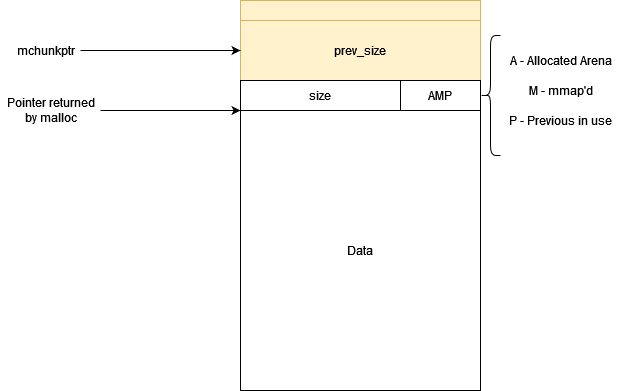

# The Heap
The heap is a memory region which allows for dynamic allocation. Memory on the heap is alloted at runtime and programs are permitted to freely request additional heap memory whenever it is required.

It is the program's job to request and relieve any heap memory *only once*. Failure to do so can result in undefined behaviour. In C, heap memory is usually allocated through the use of `malloc` and whenever the program is finished with this data, the `free` function must be envoked in order to mark the area as available for use by the operating system and/or other programs.

Heap memory can also be allocated by using malloc-compatible heap functions like `calloc`, `realloc` and `memalign` or in C++ using the corresponding `new` and `new[]` operators as well as their deallocation counterparts `delete` and `delete[]`.


## Heap Rules

1. *Do not* read or write to a pointer returned by `malloc` after that pointer has been passed to `free`. -> Can lead to use after free vulnerabilities. 
2. *Do not* use or leak uninitialised information in a heap allocation. -> Can lead to information leaks or uninitialised data vulnerabilities.
3. *Do not* read or write bytes after the end of an allocation. -> Can lead to heap overflow and read beyond bounds vulnerabilities.
4. *Do not* pass a pointer that originated from `malloc` to `free` more than once. -> Can lead to double delete vulnerabilities.
5. *Do not* write bytes before the beginning of the allocation. -> Can lead to heap underflow vulnerabilities.
6. *Do not* pass a pointer that did not originate from `malloc` to `free`.  -> Can lead to invalid free vulnerabilities.
7. *Do not* use a pointer returned by `malloc` before checking if the function returned `NULL`. -> Can lead to null-dereference bugs and sometimes arbitrary write vulnerabilities.
 
The implementation of the heap is platform specific.

# The GLIBC Heap
The heap grows from lower to higher address. 

## Chunks
The heap manager allocates resources in the so-called *chunks*. These chunks are stored adjacent to each other and must be 8-byte aligned or 16-byte aligned on 32-bit and 64-bit systems respectively. In addition to this padding, each chunks contains metadata which provides information about the chunk itself. Consequently, issuing a request for memory allocation on the heap actually allocates more bytes than originally requested.

It is important to distinguish between in-use chunks and free (or previously allocated) chunks, since they have disparate memory layouts.

The following diagram outlines a chunk that is in use:



The `size` field contains the chunk size in bytes. The following three bits carry specific meaning:
- **A (0x04)** - Allocated arena. If this bit is 0, the chunk comes from the main arena and the main heap. If this bit is 1, the chunk comes from mmap'd memory and the location of the heap can be computed from the chunk's address.
- **M (0x02)** - If this bit is set, then the chunk was `mmap`-ed and isn't part of a heap. Typically used for large allocations.
- **P (0x01)** - If this bit is set, then the previous chunk should not be considered for coalescing and the `mchunkptr` points to a previous chunk still in use

A free chunk looks a bit different:


The size and AMP fields carry on the same meaning as those in chunks that are in use. Free chunks are organised in linked or doubly linked lists called *bins*. The `fwd` and `bck` pointers are utilised in the implementation of those linked lists. Different types of bins exist for different purposes.

The top of the heap is by convention called *the top chunk*.

## Memory Allocation on the Heap
### Allocating from Free Chunks
When an application requests heap memory, the heap manager traverses the bins in search of a free chunk that is large enough to service the request. If such a chunk is found, it is removed from the bin, turned into an in-use chunk and then a pointer is returned to the user data section of the chunk.

### Allocating from the Top Chunk
If no free chunk is found that can service the request, the heap manager must construct an entirely new chunk at the top of heap. To achieve this, it first needs to ascertain whether there is enough space at the top of the heap to hold the new chunk.

### Requesting Additional Memory at the Top of the Heap from the Kernel
Once the free space at the top of the heap is used up, the heap manager will have to ask the kernel for additional memory.

On the initial heap, the heap manager asks the kernel to allocate more memory at the end of the heap by calling `sbrk`.On most Linux-based systems this function internally uses a system call called `brk`. 

Eventuall, the heap will grow to its maximum size, since expanding it any further would cause it to intrude on other sections of the process' address space. In this case, the heap manager will resort to using `mmap` to map new memory for heap expansions.

If `mmap` also fails, then the process is unable to allocate more memory and `malloc` returns `NULL`.

### Allocating Large Chunks
Large chunks get treated differently in their allocation. These are allocated off-heap through the direct use of `mmap` calls and this is reflected in the chunk's metadata by setting the `M` bit to 1. When such allocations are later returned to the heap manager via a call to `free`, the heap manager releases the entire `mmap`-ed region back to the system via `munmap`.

Different platforms have different default thresholds for what counts as a large chunk and what doesn't.

## Arenas
Multithreaded applications require that internal data structures on the heap are protected from race conditions. In the past, the heap manager availed itself of a global mutex before every heap operation, however, significant performance issues arised as a result. Consequently, the concept of "arenas" was introduced. 

Each arena consists of a separate heap which manages its own chunk allocation and bins. Although each arena still utilises a mutex for its internal operations, different threads can make use of different arenas to avoid having to wait for each other. 

The initial (main) arena consists of a single heap and for singlethreaded applications it is all there ever will exist. However, as more threads are spawned, new arenas are allocated and attached to them. Once all available arenas are being utilised by threads, the heap manager will commence creating new ones until a limit - `2 * Number of CPU cores` for 32-bit and `8 * Number of CPU cores` for 64-bit processes - is reached. Afterwards, multiple threads will be forced to share the same arena.

## Bins
Free chunks are organised in the so-called *bins* which are essentially linked lists. For performance reasons different types of bins exist. There are 62 **small bins,** 63 **large bins,** 1 **unsorted bin,** 10 **fast bins** and 64 **tcache bins** per thread. The last two appeared later and are built on top of the first three.

Pointers to the small, large, and unsorted bins are stored in the same array in the heap manager:

```cpp
BIN[0] -> invalid (unused)
BIN[1] -> unsorted bin
BIN[2] to BIN[63] -> small bins
BIN[64] to BIN[126] -> large bins
```

### Small Bins
There are 62 small bins and each of them stores chunks of a fixed size. Each chunk with a size less than 512 bytes on 32-bit systems and 1024 bytes on 64-bit systems has a corresponding small bin. Small bins are sorted by default due to the fixed size of their elements and Insertion and removal of entries on these bins is incredibly fast.


### Large Bins
There are 63 large bins and they resemble small bins in their operation but store chunks of different sizes. Consequently, insertions and removal of entries on these lists is slower, since the entire bin has to be traversed in order to find a suitable chunk. 

There is a different number of bins allocated for specific chunk size ranges. The size of the chunk size range begins at 64 bytes - there are 32 bins all of which shift the range of chunk sizes they store by 64 from the previous bin. Following are 16 bins which shift the range by 512 bytes and so on.

In essence:
- Bin 1 -> stores chunks of sizes 512 - 568 bytes;
- Bin 2 -> stores chunks of sizes 576 - 632 bytes;
- ...

There are:
Number of Bins | Spacing between Bins
----------------|--------------------
32 | 64
16 | 512
8 | 4096
4 | 32768
2 | 262144
1 | Remaining chunk sizes


### Unsorted Bins
There is a single unsorted bin. Chunks from small and large bins end up directly in this bin after they are freed. The point of the unsorted bin is to speed up allocations by serving a sort of cache. When `malloc` is invoked, it will first traverse this bin and see if it can immediately service the request. If not, it will move onto the small or large bins respectively.

### Fast Bins
Fast bins provide a further optimisation layer. Recently released small chunks are put in fast bins and are not initially merged with their neighbours. This allows for them to be repurposed forthwith, should a `malloc` request for that chunk size come very soon after the chunk's release. There are 10 fast bins, covering chunks of size 16, 24, 32, 40, 48, 56, 64, 72, 80, and 88 bytes plus chunk metadata.

Fast bins are implemented as singly linked lists and insertions and removals of entries in them are really fast. Periodically, the heap manager *consolidates* the heap - chunks in the fast bins are merged with the abutting chunks and inserted into the unsorted bin.

### TCache Bins
A new caching mechanism called *tcache* (thread local caching) was introduced in glibc version 2.26 back in 2017. 

The tcache stores bins of fixed size small chunks as singly linked lists. Similarly to a fast bin, chunks in tcache bins aren't merged with adjoining chunks. By default, there are 64 tcache bins, each containing a maximum of 7 same-sized chunks. The possible chunk sizes range from 12 to 516 bytes on 32-bit systems and from 24 to 1032 bytes on 64-bit systems.

When a chunk is freed, the heap manager checks if the chunk fits into a tcache bin corresponding to that chunk size. If the tcache bin for this size is full or the chunk is simply too big to fit into a tcache bin, the heap manager obtains a lock on the arena and proceeds to comb through other bins in order to find a suitable one for the chunk.

When `malloc` needs to service a request, it first checks the tcache for a chunk of the requested size that is available and should such a chunk be found, `malloc` will return it without ever having to obtain a lock. If the chunk too big, `malloc` continues as before.

A slightly different strategy is employed if the requested chunk size does have a corresponding tcache bin, but that bin is simply full. In that case, `malloc` obtains a lock and promotes as many heap chunks of the requested size to tcache chunks, up to the tcache bin limit of 7. Subsequently, the last matching chunk is returned.