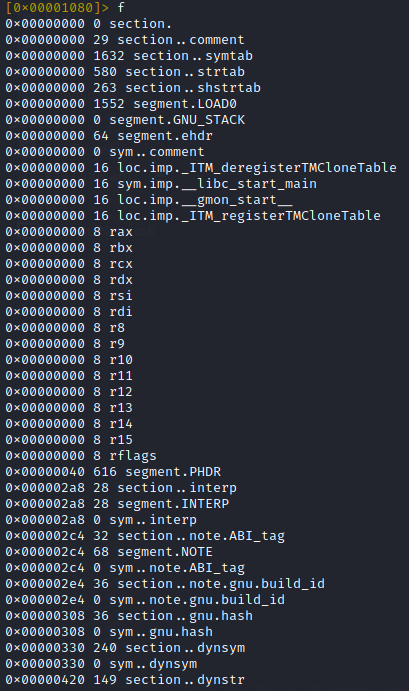

# Flags
Flags resemble bookmarks. They associate a name with a given offset in a file.

Create a new flag
```
f <name> @ offset
```

You can also remove a flag by appending `-` to the command:
```
f-<name>
```

List available flags - `f`:



Rename a flag
```
fr <old name> <new name>
```

## Local Flags
Flag names should be unique for addressing reasons. However, it is often the case that you need to have simple and ubiquitous names like `loop` or `return`. For this purpose exist the so-called "local" flags, which are tied to the function where they reside. It is possible to add them using `f.` command:

# Flag Spaces
 Flags can be grouped into flag spaces - is a namespace for flags, grouping together similar flags. Some flag spaces include sections, registers, symbols. These are managed with the `fs` command.
 
 ```bash
[0x00001080]> fs?
Usage: fs [*] [+-][flagspace|addr]   # Manage flagspaces
| fs            display flagspaces
| fs*           display flagspaces as r2 commands
| fsj           display flagspaces in JSON
| fs *          select all flagspaces
| fs flagspace  select flagspace or create if it doesn't exist
| fs-flagspace  remove flagspace
| fs-*          remove all flagspaces
| fs+foo        push previous flagspace and set
| fs-           pop to the previous flagspace
| fs-.          remove the current flagspace
| fsq           list flagspaces in quiet mode
| fsm [addr]    move flags at given address to the current flagspace
| fss           display flagspaces stack
| fss*          display flagspaces stack in r2 commands
| fssj          display flagspaces stack in JSON
| fsr newname   rename selected flagspace
```