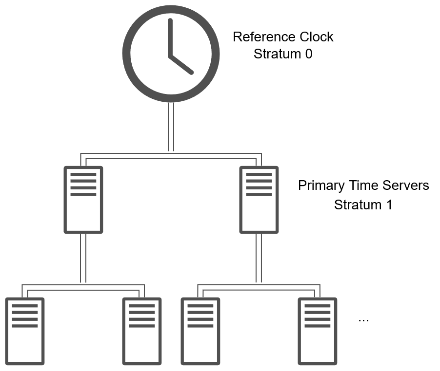
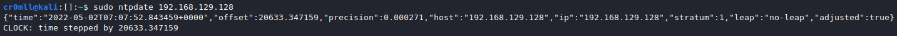

# Network Time Protocol (NTP)

## Introduction

The **N**etwork **T**ime **P**rotocol (NTP) is a protocol for clock synchronisation across computer systems. Its existence is paramount in order to pinpoint events occurring at a certain moment within a network. Devices with unsynchronised clocks will report that the event transpired at different times thus making it very difficult to figure out the actual time of occurrence.

This protocol works over UDP on port 123.

## How does NTP work?

NTP utilises a hierarchy system. Each clock is assigned a _stratum_. Stratum values range between 0 and 15, with a value of 16 denoting an unsynchronised clock. Devices of Stratum 0 are called reference clocks and these are one of the most accurate time-keeping machines such as atomic clocks. The stratum value, therefore, represents the distance from the reference clock or how accurate a given clock is in comparison to a device of Stratum 0. Every new layer adds a 1 to the stratum value.

Reference clocks are not directly connected to the network. Instead, the so-called _primary time servers_ connect to the reference clock and synchronise their clocks with it. These servers have a stratum value of 1. For each layer you go down the chain, the stratum value increases by 1, since the distance from the reference clocks augments.

## Synchronising time on Linux with `ntpdate`

`ntpdate` is a useful utility for synching time on Linux machines through NTP. Its syntax is really simple:

`ntpdate [server]`

In order to set the date, it requires root privileges:

Synching the time with a Windows machine on my network:

New time:

It can also be useful to only check how unsynched your time is with respect to another clock. You can do this by adding the `-q` option. This does not require root privileges.

That's quite the difference!
